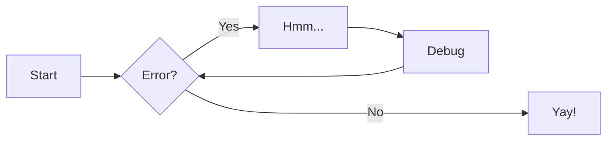
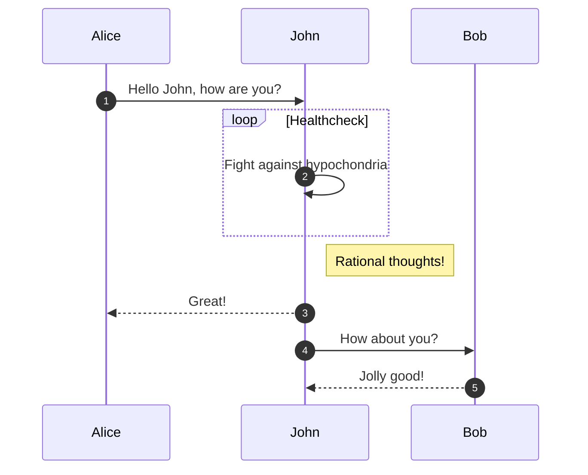
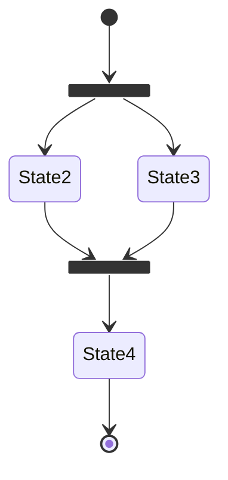
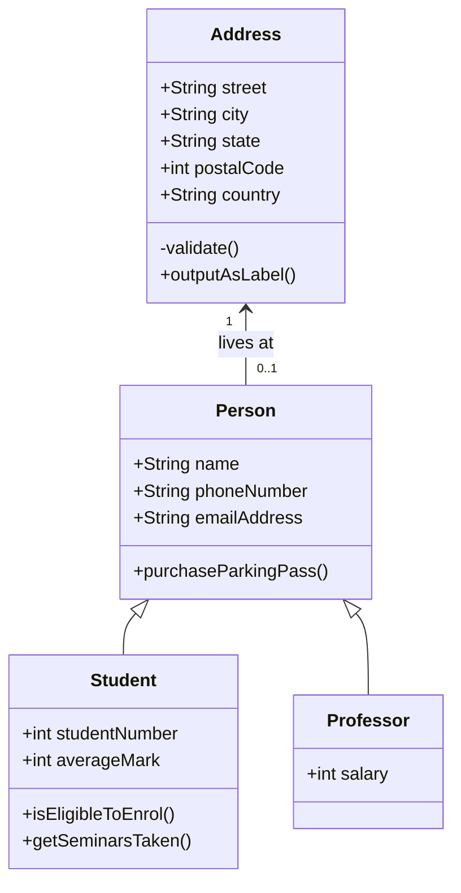
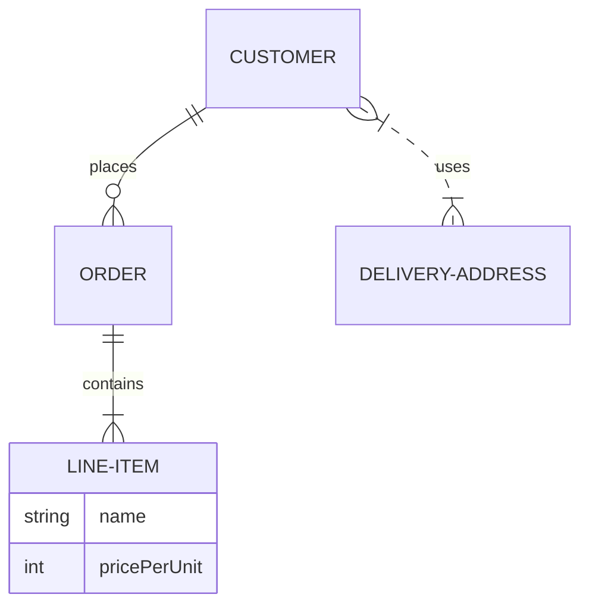

# Getting started

Material for MkDocs is a powerful documentation framework on top of [MkDocs],
a static site generator for project documentation.[^1] If you're familiar with
Python, you can install Material for MkDocs with [`pip`][pip], the Python
package manager. If not, we recommend using [`docker`][docker].

  [^1]:
    In 2016, Material for MkDocs started out as a simple theme for MkDocs, but
    over the course of several years, it's now much more than that – with the
    many built-in plugins, settings, and countless customization abilities,
    Material for MkDocs is now one of the simplest and most powerful frameworks
    for creating documentation for your project.

  [MkDocs]: https://www.mkdocs.org
  [pip]: #with-pip
  [docker]: #with-docker

## Installation

### with pip <small>recommended</small> { #with-pip data-toc-label="with pip" }

Material for MkDocs is published as a [Python package] and can be installed with
`pip`, ideally by using a [virtual environment]. Open up a terminal and install
Material for MkDocs with:

=== "Latest"

    ``` sh
    pip install mkdocs-material
    ```

=== "9.x"

    ``` sh
    pip install mkdocs-material=="9.*" # (1)!
    ```

    1.  Material for MkDocs uses [semantic versioning][^2], which is why it's a
        good idea to limit upgrades to the current major version.

        This will make sure that you don't accidentally [upgrade to the next
        major version], which may include breaking changes that silently corrupt
        your site. Additionally, you can use `pip freeze` to create a lockfile,
        so builds are reproducible at all times:

        ```
        pip freeze > requirements.txt
        ```

        Now, the lockfile can be used for installation:

        ```
        pip install -r requirements.txt
        ```

  [^2]:
    Note that improvements of existing features are sometimes released as
    patch releases, like for example improved rendering of content tabs, as
    they're not considered to be new features.

This will automatically install compatible versions of all dependencies:
[MkDocs], [Markdown], [Pygments] and [Python Markdown Extensions]. Material for
MkDocs always strives to support the latest versions, so there's no need to
install those packages separately.

---

:fontawesome-brands-youtube:{ style="color: #EE0F0F" }
__[How to set up Material for MkDocs]__ by @james-willett – :octicons-clock-24:
27m – Learn how to create and host a documentation site using Material for
MkDocs on GitHub Pages in a step-by-step guide.

  [How to set up Material for MkDocs]: https://www.youtube.com/watch?v=xlABhbnNrfI

---

!!! tip

    If you don't have prior experience with Python, we recommend reading
    [Using Python's pip to Manage Your Projects' Dependencies], which is a
    really good introduction on the mechanics of Python package management and
    helps you troubleshoot if you run into errors.

  [Python package]: https://pypi.org/project/mkdocs-material/
  [virtual environment]: https://realpython.com/what-is-pip/#using-pip-in-a-python-virtual-environment
  [semantic versioning]: https://semver.org/
  [upgrade to the next major version]: upgrade.md
  [Markdown]: https://python-markdown.github.io/
  [Pygments]: https://pygments.org/
  [Python Markdown Extensions]: https://facelessuser.github.io/pymdown-extensions/
  [Using Python's pip to Manage Your Projects' Dependencies]: https://realpython.com/what-is-pip/

### with docker

The official [Docker image] is a great way to get up and running in a few
minutes, as it comes with all dependencies pre-installed. Open up a terminal
and pull the image with:

=== "Latest"

    ```
    docker pull squidfunk/mkdocs-material
    ```

=== "9.x"

    ```
    docker pull squidfunk/mkdocs-material:9
    ```

The `mkdocs` executable is provided as an entry point and `serve` is the
default command. If you're not familiar with Docker don't worry, we have you
covered in the following sections.

The following plugins are bundled with the Docker image:

- [mkdocs-minify-plugin]
- [mkdocs-redirects]

  [Docker image]: https://hub.docker.com/r/squidfunk/mkdocs-material/
  [mkdocs-minify-plugin]: https://github.com/byrnereese/mkdocs-minify-plugin
  [mkdocs-redirects]: https://github.com/datarobot/mkdocs-redirects

???+ warning

    The Docker container is intended for local previewing purposes only and
    is not suitable for deployment. This is because the web server used by
    MkDocs for live previews is not designed for production use and may have
    security vulnerabilities.

??? question "How to add plugins to the Docker image?"

    Material for MkDocs only bundles selected plugins in order to keep the size
    of the official image small. If the plugin you want to use is not included,
    you can add them easily:

    === "Material for MkDocs"

        Create a `Dockerfile` and extend the official image:

        ``` Dockerfile title="Dockerfile"
        FROM squidfunk/mkdocs-material
        RUN pip install mkdocs-macros-plugin
        RUN pip install mkdocs-glightbox
        ```

    === "Insiders"

        Clone or fork the Insiders repository, and create a file called
        `user-requirements.txt` in the root of the repository. Then, add the
        plugins that should be installed to the file, e.g.:

        ``` txt title="user-requirements.txt"
        mkdocs-macros-plugin
        mkdocs-glightbox
        ```

    Next, build the image with the following command:

    ```
    docker build -t squidfunk/mkdocs-material .
    ```

    The new image will have additional packages installed and can be used
    exactly like the official image.

### with git

Material for MkDocs can be directly used from [GitHub] by cloning the
repository into a subfolder of your project root which might be useful if you
want to use the very latest version:

```
git clone https://github.com/squidfunk/mkdocs-material.git
```

Next, install the theme and its dependencies with:

```
pip install -e mkdocs-material
```

  [GitHub]: https://github.com/squidfunk/mkdocs-material


# Creating your site

After you've [installed] Material for MkDocs, you can bootstrap your project
documentation using the `mkdocs` executable. Go to the directory where you want
your project to be located and enter:

```
mkdocs new .
```

Alternatively, if you're running Material for MkDocs from within Docker, use:

=== "Unix, Powershell"

    ```
    docker run --rm -it -v ${PWD}:/docs squidfunk/mkdocs-material new .
    ```

=== "Windows (cmd)"

    ```
    docker run --rm -it -v "%cd%":/docs squidfunk/mkdocs-material new .
    ```

This will create the following structure:

``` { .sh .no-copy }
.
├─ docs/
│  └─ index.md
└─ mkdocs.yml
```

  [installed]: getting-started.md

## Configuration

### Minimal configuration

Simply set the `site_name` and add the following lines to `mkdocs.yml` to enable the theme:

``` yaml hl_lines="2-5"
site_name: My site
site_url: https://mydomain.org/mysite
theme:
  name: material
```

The `site_url` setting is important for a number of reasons.
By default, MkDocs will assume that your site is hosted at the root of
your domain. This is not the case, for example, when [publishing to GitHub
pages] - unless you use a custom domain. Another reason is that some of the
plugins require the `site_url` to be set, so you should always do this.

  [publishing to GitHub pages]: publishing-your-site.md#github-pages
  [installation methods]: getting-started.md#installation

???+ tip "Recommended: [configuration validation and auto-complete]"

    In order to minimize friction and maximize productivity, Material for MkDocs
    provides its own [schema.json][^1] for `mkdocs.yml`. If your editor supports
    YAML schema validation, it's definitely recommended to set it up:

    === "Visual Studio Code"

        1.  Install [`vscode-yaml`][vscode-yaml] for YAML language support.
        2.  Add the schema under the `yaml.schemas` key in your user or
            workspace [`settings.json`][settings.json]:

            ``` json
            {
              "yaml.schemas": {
                "https://squidfunk.github.io/mkdocs-material/schema.json": "mkdocs.yml"
              },
              "yaml.customTags": [ // (1)!
                "!ENV scalar",
                "!ENV sequence",
                "!relative scalar",
                "tag:yaml.org,2002:python/name:material.extensions.emoji.to_svg",
                "tag:yaml.org,2002:python/name:material.extensions.emoji.twemoji",
                "tag:yaml.org,2002:python/name:pymdownx.superfences.fence_code_format",
                "tag:yaml.org,2002:python/object/apply:pymdownx.slugs.slugify mapping"
              ]
            }
            ```

            1.  This setting is necessary if you plan to use [icons and emojis],
                or Visual Studio Code will show errors on certain lines.

    === "Other"

        1.  Ensure your editor of choice has support for YAML schema validation.
        2.  Add the following lines at the top of `mkdocs.yml`:

            ``` yaml
            # yaml-language-server: $schema=https://squidfunk.github.io/mkdocs-material/schema.json
            ```

  [^1]:
    If you're a MkDocs plugin or Markdown extension author and your project
    works with Material for MkDocs, you're very much invited to contribute a
    schema for your [extension] or [plugin] as part of a pull request on GitHub.
    If you already have a schema defined, or wish to self-host your schema to
    reduce duplication, you can add it via [$ref].

  [configuration validation and auto-complete]: https://x.com/squidfunk/status/1487746003692400642
  [schema.json]: schema.json
  [vscode-yaml]: https://marketplace.visualstudio.com/items?itemName=redhat.vscode-yaml
  [settings.json]: https://code.visualstudio.com/docs/getstarted/settings
  [extension]: https://github.com/squidfunk/mkdocs-material/tree/master/docs/schema/extensions
  [plugin]: https://github.com/squidfunk/mkdocs-material/tree/master/docs/schema/plugins
  [$ref]: https://json-schema.org/understanding-json-schema/structuring.html#ref
  [icons and emojis]: reference/icons-emojis.md

### Advanced configuration

Material for MkDocs comes with many configuration options. The setup section
explains in great detail how to configure and customize colors, fonts, icons
and much more:

<div class="mdx-columns" markdown>

- [Changing the colors]
- [Changing the fonts]
- [Changing the language]
- [Changing the logo and icons]
- [Ensuring data privacy]
- [Setting up navigation]
- [Setting up site search]
- [Setting up site analytics]
- [Setting up social cards]
- [Setting up a blog]
- [Setting up tags]
- [Setting up versioning]
- [Setting up the header]
- [Setting up the footer]
- [Adding a git repository]
- [Adding a comment system]
- [Building an optimized site]
- [Building for offline usage]

</div>

Furthermore, see the list of supported [Markdown extensions] that are natively
integrated with Material for MkDocs, delivering an unprecedented low-effort
technical writing experience.

  [Changing the colors]: setup/changing-the-colors.md
  [Changing the fonts]: setup/changing-the-fonts.md
  [Changing the language]: setup/changing-the-language.md
  [Changing the logo and icons]: setup/changing-the-logo-and-icons.md
  [Ensuring data privacy]: setup/ensuring-data-privacy.md
  [Setting up navigation]: setup/setting-up-navigation.md
  [Setting up site search]: setup/setting-up-site-search.md
  [Setting up site analytics]: setup/setting-up-site-analytics.md
  [Setting up social cards]: setup/setting-up-social-cards.md
  [Setting up a blog]: setup/setting-up-a-blog.md
  [Setting up tags]: setup/setting-up-tags.md
  [Setting up versioning]: setup/setting-up-versioning.md
  [Setting up the header]: setup/setting-up-the-header.md
  [Setting up the footer]: setup/setting-up-the-footer.md
  [Adding a git repository]: setup/adding-a-git-repository.md
  [Adding a comment system]: setup/adding-a-comment-system.md
  [Building for offline usage]: setup/building-for-offline-usage.md
  [Building an optimized site]: setup/building-an-optimized-site.md
  [Markdown extensions]: setup/extensions/index.md

## Templates

If you want to jump start a new project, you can use one of our growing
collection of templates:

<div class="grid cards" markdown>

-   :octicons-repo-template-24: &nbsp; __[Blog][blog-template]__

    ---

    Create a blog

-   :octicons-repo-template-24: &nbsp; __[Social cards][social-cards-template]__

    ---

    Create documentation with social cards

</div>

[blog-template]: https://github.com/mkdocs-material/create-blog
[social-cards-template]: https://github.com/mkdocs-material/create-social-cards

## Previewing as you write

MkDocs includes a live preview server, so you can preview your changes as you
write your documentation. The server will automatically rebuild the site upon
saving. Start it with:

``` sh
mkdocs serve # (1)!
```

1.  If you have a large documentation project, it might take minutes until
    MkDocs has rebuilt all pages for you to preview. If you're only interested
    in the current page, the [`--dirtyreload`][--dirtyreload] flag will make
    rebuilds much faster:

    ```
    mkdocs serve --dirtyreload
    ```

If you're running Material for MkDocs from within Docker, use:

=== "Unix, Powershell"

    ```
    docker run --rm -it -p 8000:8000 -v ${PWD}:/docs squidfunk/mkdocs-material
    ```

=== "Windows"

    ```
    docker run --rm -it -p 8000:8000 -v "%cd%":/docs squidfunk/mkdocs-material
    ```

Point your browser to [localhost:8000][live preview] and you should see:

[![Creating your site]][Creating your site]

  [--dirtyreload]: https://www.mkdocs.org/about/release-notes/#support-for-dirty-builds-990
  [live preview]: http://localhost:8000
  [Creating your site]: assets/screenshots/creating-your-site.png

## Building your site

When you're finished editing, you can build a static site from your Markdown
files with:

```
mkdocs build
```

If you're running Material for MkDocs from within Docker, use:

=== "Unix, Powershell"

    ```
    docker run --rm -it -v ${PWD}:/docs squidfunk/mkdocs-material build
    ```

=== "Windows"

    ```
    docker run --rm -it -v "%cd%":/docs squidfunk/mkdocs-material build
    ```

The contents of this directory make up your project documentation. There's no
need for operating a database or server, as it is completely self-contained.
The site can be hosted on [GitHub Pages], [GitLab Pages], a CDN of your choice
or your private web space.

  [GitHub Pages]: publishing-your-site.md#github-pages
  [GitLab pages]: publishing-your-site.md#gitlab-pages

If you intend to distribute your documentation as a set of files to be
read from a local filesystem rather than a web server (such as in a
`.zip` file), please read the notes about [building for offline
usage].

  [building for offline usage]: setup/building-for-offline-usage.md

# Customization

Project documentation is as diverse as the projects themselves and Material for
MkDocs is a great starting point for making it look beautiful. However, as you
write your documentation, you may reach a point where small adjustments are
necessary to preserve your brand's style.

## Adding assets

[MkDocs] provides several ways to customize a theme. In order to make a few
small tweaks to Material for MkDocs, you can just add CSS and JavaScript files to
the `docs` directory.

  [MkDocs]: https://www.mkdocs.org

### Additional CSS

If you want to tweak some colors or change the spacing of certain elements,
you can do this in a separate style sheet. The easiest way is by creating a
new style sheet file in the `docs` directory:

``` { .sh .no-copy }
.
├─ docs/
│  └─ stylesheets/
│     └─ extra.css
└─ mkdocs.yml
```

Then, add the following lines to `mkdocs.yml`:

``` yaml
extra_css:
  - stylesheets/extra.css
```

### Additional JavaScript

If you want to integrate another syntax highlighter or add some custom logic to
your theme, create a new JavaScript file in the `docs` directory:

``` { .sh .no-copy }
.
├─ docs/
│  └─ javascripts/
│     └─ extra.js
└─ mkdocs.yml
```

Then, add the following lines to `mkdocs.yml`:

``` yaml
extra_javascript:
  - javascripts/extra.js
```

??? tip "How to integrate with third-party JavaScript libraries"

    It is likely that you will want to run your JavaScript code only
    once the page has been fully loaded by the browser. This means
    installing a callback function subscribing to events on the
    `document$` observable exported by Material for MkDocs.
    Using the `document$` observable is particularly important if you
    are using [instant loading] since it will not result in a page
    refresh in the browser - but subscribers on the observable will be
    notified.

    ``` javascript
    document$.subscribe(function() {
      console.log("Initialize third-party libraries here")
    })
    ```

    `document$` is an [RxJS Observable] and you can call the `subscribe()`
    method any number of times to attach different functionality.

  [instant loading]: setup/setting-up-navigation.md/#instant-loading
  [RxJS Observable]: https://rxjs.dev/api/index/class/Observable

## Extending the theme

If you want to alter the HTML source (e.g. add or remove some parts), you can
extend the theme. MkDocs supports [theme extension], an easy way to override
parts of Material for MkDocs without forking from git. This ensures that you
can update to the latest version more easily.

  [theme extension]: https://www.mkdocs.org/user-guide/customizing-your-theme/#using-the-theme-custom_dir

### Setup and theme structure

Enable Material for MkDocs as usual in `mkdocs.yml`, and create a new folder
for `overrides` which you then reference using the [`custom_dir`][custom_dir]
setting:

``` yaml
theme:
  name: material
  custom_dir: overrides
```

!!! warning "Theme extension prerequisites"

    As the [`custom_dir`][custom_dir] setting is used for the theme extension
    process, Material for MkDocs needs to be installed via `pip` and referenced
    with the [`name`][name] setting in `mkdocs.yml`. It will not work when
    cloning from `git`.

The structure in the `overrides` directory must mirror the directory structure
of the original theme, as any file in the `overrides` directory will replace the
file with the same name which is part of the original theme. Besides, further
assets may also be put in the `overrides` directory:

``` { .sh .no-copy }
.
├─ .icons/                             # Bundled icon sets
├─ assets/
│  ├─ images/                          # Images and icons
│  ├─ javascripts/                     # JavaScript files
│  └─ stylesheets/                     # Style sheets
├─ partials/
│  ├─ integrations/                    # Third-party integrations
│  │  ├─ analytics/                    # Analytics integrations
│  │  └─ analytics.html                # Analytics setup
│  ├─ languages/                       # Translation languages
│  ├─ actions.html                     # Actions
│  ├─ alternate.html                   # Site language selector
│  ├─ comments.html                    # Comment system (empty by default)
│  ├─ consent.html                     # Consent
│  ├─ content.html                     # Page content
│  ├─ copyright.html                   # Copyright and theme information
│  ├─ feedback.html                    # Was this page helpful?
│  ├─ footer.html                      # Footer bar
│  ├─ header.html                      # Header bar
│  ├─ icons.html                       # Custom icons
│  ├─ language.html                    # Translation setup
│  ├─ logo.html                        # Logo in header and sidebar
│  ├─ nav.html                         # Main navigation
│  ├─ nav-item.html                    # Main navigation item
│  ├─ pagination.html                  # Pagination (used for blog)
│  ├─ palette.html                     # Color palette toggle
│  ├─ post.html                        # Blog post excerpt
│  ├─ progress.html                    # Progress indicator
│  ├─ search.html                      # Search interface
│  ├─ social.html                      # Social links
│  ├─ source.html                      # Repository information
│  ├─ source-file.html                 # Source file information
│  ├─ tabs.html                        # Tabs navigation
│  ├─ tabs-item.html                   # Tabs navigation item
│  ├─ tags.html                        # Tags
│  ├─ toc.html                         # Table of contents
│  ├─ toc-item.html                    # Table of contents item
│  └─ top.html                         # Back-to-top button
├─ 404.html                            # 404 error page
├─ base.html                           # Base template
├─ blog.html                           # Blog index page
├─ blog-archive.html                   # Blog archive index page
├─ blog-category.html                  # Blog category index page
├─ blog-post.html                      # Blog post page
└─ main.html                           # Default page
```

  [custom_dir]: https://www.mkdocs.org/user-guide/configuration/#custom_dir
  [name]: https://www.mkdocs.org/user-guide/configuration/#name

### Overriding partials

In order to override a partial, we can replace it with a file of the same name
and location in the `overrides` directory. For example, to replace the original
`footer.html` partial, create a new `footer.html` partial in the `overrides`
directory:

``` { .sh .no-copy }
.
├─ overrides/
│  └─ partials/
│     └─ footer.html
└─ mkdocs.yml
```

MkDocs will now use the new partial when rendering the theme. This can be done
with any file.

### Overriding blocks <small>recommended</small> { #overriding-blocks data-toc-label="Overriding blocks" }

Besides overriding partials, it's also possible to override (and extend)
template blocks, which are defined inside the templates and wrap specific
features. In order to set up block overrides, create a `main.html` file inside
the `overrides` directory:

``` { .sh .no-copy }
.
├─ overrides/
│  └─ main.html
└─ mkdocs.yml
```

Then, e.g. to override the site title, add the following lines to `main.html`:

``` html



  <title>Lorem ipsum dolor sit amet</title>

```

If you intend to __add__ something to a block rather than to replace it
altogether with new content, use `{{ super() }}` inside the block to include the
original block content. This is particularly useful when adding third-party
scripts to your docs, e.g.

``` html



  <!-- Add scripts that need to run before here -->
  {{ super() }}
  <!-- Add scripts that need to run afterwards here -->

```

The following template blocks are provided by the theme:

| Block name        | Purpose                                         |
| :---------------- | :---------------------------------------------- |
| `analytics`       | Wraps the Google Analytics integration          |
| `announce`        | Wraps the announcement bar                      |
| `config`          | Wraps the JavaScript application config         |
| `container`       | Wraps the main content container                |
| `content`         | Wraps the main content                          |
| `extrahead`       | Empty block to add custom meta tags             |
| `fonts`           | Wraps the font definitions                      |
| `footer`          | Wraps the footer with navigation and copyright  |
| `header`          | Wraps the fixed header bar                      |
| `hero`            | Wraps the hero teaser (if available)            |
| `htmltitle`       | Wraps the `<title>` tag                         |
| `libs`            | Wraps the JavaScript libraries (header)         |
| `outdated`        | Wraps the version warning                       |
| `scripts`         | Wraps the JavaScript application (footer)       |
| `site_meta`       | Wraps the meta tags in the document head        |
| `site_nav`        | Wraps the site navigation and table of contents |
| `styles`          | Wraps the style sheets (also extra sources)     |
| `tabs`            | Wraps the tabs navigation (if available)        |

## Theme development

Material for MkDocs is built on top of [TypeScript], [RxJS] and [SASS], and
uses a lean, custom build process to put everything together.[^1] If you want
to make more fundamental changes, it may be necessary to make the adjustments
directly in the source of the theme and recompile it.

  [^1]:
    Prior to <!-- md:version 7.0.0 --> the build was based on Webpack, resulting
    in occasional broken builds due to incompatibilities with loaders and
    plugins. Therefore, we decided to swap Webpack for a leaner solution which
    is now based on [RxJS] as the application itself. This allowed for the
    pruning of more than 500 dependencies (~30% less).

  [TypeScript]: https://www.typescriptlang.org/
  [RxJS]: https://github.com/ReactiveX/rxjs
  [SASS]: https://sass-lang.com

### Environment setup

First, clone the repository for the edition you want to work on. If
you want to clone the Insiders repository, you need to become a
sponsor first to gain access.

  [Insiders]: insiders/index.md

=== "Material for MkDocs"

    ```
    git clone https://github.com/squidfunk/mkdocs-material
    cd mkdocs-material
    ```

=== "Insiders"

    You will need to have a GitHub access token [as described in the
    Insiders documentation] and make it available in the `$GH_TOKEN`
    variable.

    ``` sh
    git clone https://${GH_TOKEN}@github.com/squidfunk/mkdocs-material-insiders.git # (1)!
    ```

    1.  If you are using SSH keys for authenticating with GitHub, you can
        clone Insiders with this command:

        ```
        git clone git@github.com:squidfunk/mkdocs-material-insiders.git
        ```

    [as described in the Insiders documentation]: insiders/getting-started.md#requirements

Next, create a new [Python virtual environment][venv] and
[activate][venv-activate] it:

```
python -m venv venv
source venv/bin/activate
```

!!! note "Ensure pip always runs in a virtual environment"

    If you set the environment variable `PIP_REQUIRE_VIRTUALENV` to
    `true`, `pip` will refuse to install anything outside a virtual
    environment. Forgetting to activate a `venv` can be very annoying
    as it will install all sorts of things outside virtual
    environments over time, possibly leading to further errors. So,
    you may want to add this to your `.bashrc` or `.zshrc` and
    re-start your shell:

    ```
    export PIP_REQUIRE_VIRTUALENV=true
    ```

  [venv]: https://docs.python.org/3/library/venv.html
  [venv-activate]: https://docs.python.org/3/library/venv.html#how-venvs-work

Then, install all Python dependencies:

=== "Material for MkDocs"

    ```
    pip install -e ".[recommended]"
    pip install nodeenv
    ```

=== "Insiders"

    ```
    pip install -e ".[recommended, imaging]"
    pip install nodeenv
    ```

    In addition, you will need to install the `cairo` and `pngquant` libraries in your
    system, as described in the [image processing] requirements guide.

    [image processing]: plugins/requirements/image-processing.md


Finally, install the [Node.js] LTS version into the Python virtual environment
and install all Node.js dependencies:

```
nodeenv -p -n lts
npm install
```

  [Node.js]: https://nodejs.org

### Development mode

Start the watcher with:

```
npm start
```

Then, in a second terminal window, start the MkDocs live preview server with:

```
mkdocs serve --watch-theme
```

Point your browser to [localhost:8000][live preview] and you should see this
very documentation in front of you.

!!! warning "Automatically generated files"

    Never make any changes in the `material` directory, as the contents of this
    directory are automatically generated from the `src` directory and will be
    overwritten when the theme is built.

  [live preview]: http://localhost:8000

### Building the theme

When you're finished making your changes, you can build the theme by invoking:

``` sh
npm run build # (1)!
```

1.  While this command will build all theme files, it will skip the overrides
    used in Material for MkDocs' own documentation which are not distributed
    with the theme. If you forked the theme and want to build the overrides
    as well, e.g. before submitting a PR with changes, use:

    ```
    npm run build:all
    ```

    This will take longer, as now the icon search index, schema files, as
    well as additional style sheet and JavaScript files are built.

This triggers the production-level compilation and minification of all style
sheets and JavaScript files. After the command exits, the compiled files are
located in the `material` directory. When running `mkdocs build`, you should
now see your changes to the original theme.

---
icon: material/code-json
---

# Code blocks

Code blocks and examples are an essential part of technical project
documentation. Material for MkDocs provides different ways to set up syntax
highlighting for code blocks, either during build time using [Pygments] or
during runtime using a JavaScript syntax highlighter.

  [Pygments]: https://pygments.org

## Configuration

This configuration enables syntax highlighting on code blocks and inline code
blocks, and allows to include source code directly from other files. Add the
following lines to `mkdocs.yml`:

``` yaml
markdown_extensions:
  - pymdownx.highlight:
      anchor_linenums: true
      line_spans: __span
      pygments_lang_class: true
  - pymdownx.inlinehilite
  - pymdownx.snippets
  - pymdownx.superfences
```

The following sections discuss how to use different syntax highlighting features
with [Pygments], the recommended highlighter, so they don't apply when using a
JavaScript syntax highlighter.

See additional configuration options:

- [Highlight]
- [InlineHilite]
- [SuperFences]
- [Snippets]

  [Highlight]: ../setup/extensions/python-markdown-extensions.md#highlight
  [InlineHilite]: ../setup/extensions/python-markdown-extensions.md#inlinehilite
  [SuperFences]: ../setup/extensions/python-markdown-extensions.md#superfences
  [Snippets]: ../setup/extensions/python-markdown-extensions.md#snippets

### Code copy button

<!-- md:version 9.0.0 -->
<!-- md:feature -->

Code blocks can automatically render a button on the right side to allow the
user to copy a code block's contents to the clipboard. Add the following to
`mkdocs.yml` to enable them globally:

``` yaml
theme:
  features:
    - content.code.copy
```

??? info "Enabling or disabling code copy buttons for a specific code block"

    If you don't want to enable code copy buttons globally, you can enable them
    for a specific code block by using a slightly different syntax based on the
    [Attribute Lists] extension:

    ```` yaml
    ``` { .yaml .copy }
    # Code block content
    ```
    ````

    Note that there must be a language shortcode, which has to come first and
    must also be prefixed by a `.`. Similarly, the copy button can also be
    disabled for a specific code block:

    ```` { .yaml .no-copy }
    ``` { .yaml .no-copy }
    # Code block content
    ```
    ````

    To enable or disable the copy button without syntax highlighting, you can
    use the `.text` language shortcode, which doesn't highlight anything.

### Code selection button

<!-- md:sponsors -->
<!-- md:version insiders-4.32.0 -->
<!-- md:flag experimental -->

Code blocks can include a button to allow for the selection of line ranges by
the user, which is perfect for linking to a specific subsection of a code block. This allows the user to apply [line highlighting] dynamically. Add the following
to `mkdocs.yml` to enable it globally:

``` yaml
theme:
  features:
    - content.code.select
```

??? info "Enabling or disabling code selection buttons for a specific code block"

    If you don't want to enable code selection buttons globally, you can enable
    them for a specific code block by using a slightly different syntax based on
    the [Attribute Lists] extension:

    ```` yaml
    ``` { .yaml .select }
    # Code block content
    ```
    ````

    Note that the language shortcode which has to come first must now also be
    prefixed by a `.`. Similarly, the selection button can also be disabled for
    a specific code block:

    ```` { .yaml .no-select }
    ``` { .yaml .no-select }
    # Code block content
    ```
    ````

  [line highlighting]: #highlighting-specific-lines

### Code annotations

<!-- md:version 8.0.0 -->
<!-- md:feature -->

Code annotations offer a comfortable and friendly way to attach arbitrary
content to specific sections of code blocks by adding numeric markers in block
and inline comments in the language of the code block. Add the following to
`mkdocs.yml` to enable them globally:

``` yaml
theme:
  features:
    - content.code.annotate # (1)!
```

1.  :man_raising_hand: I'm a code annotation! I can contain `code`, __formatted
    text__, images, ... basically anything that can be written in Markdown.

??? info "Enabling code annotations for a specific code block"

    If you don't want to enable code annotations globally, because you don't
    like the automatic inlining behavior, you can enable them for a specific
    code block by using a slightly different syntax based on the
    [Attribute Lists] extension:

    ```` yaml
    ``` { .yaml .annotate }
    # Code block content
    ```
    ````

    Note that the language shortcode which has to come first must now also be
    prefixed by a `.`.

  [Attribute Lists]: ../setup/extensions/python-markdown.md#attribute-lists

#### Custom selectors

<!-- md:sponsors -->
<!-- md:version insiders-4.32.0 -->
<!-- md:flag experimental -->

Normally, code annotations can only be [placed in comments], as comments can be
considered safe for placement. However, sometimes it might be necessary to place
annotations in parts of the code block where comments are not allowed, e.g. in
strings.

Additional selectors can be set per-language:

``` yaml
extra:
  annotate:
    json: [.s2] # (1)!
```

1.  [`.s2`][s2] is the name of the lexeme that [Pygments] generates for double-quoted
    strings. If you want to use a code annotation in another lexeme than a
    comment, inspect the code block and determine which lexeme needs to be added
    to the list of additional selectors.

    __Important__: Code annotations cannot be split between lexemes.

Now, code annotations can be used from within strings in JSON:

``` json
{
  "key": "value (1)"
}
```

1.  :man_raising_hand: I'm a code annotation! I can contain `code`, __formatted
    text__, images, ... basically anything that can be written in Markdown.

  [placed in comments]: #adding-annotations
  [s2]: https://github.com/squidfunk/mkdocs-material/blob/87d5ca487b9d9ab95c41ee72813149d214048693/src/assets/stylesheets/main/extensions/pymdownx/_highlight.scss#L45

## Usage

Code blocks must be enclosed with two separate lines containing three backticks.
To add syntax highlighting to those blocks, add the language shortcode directly
after the opening block. See the [list of available lexers] to find the
shortcode for a given language:

```` markdown title="Code block"
``` py
import tensorflow as tf
```
````

<div class="result" markdown>

``` py
import tensorflow as tf
```

</div>

  [list of available lexers]: https://pygments.org/docs/lexers/

### Adding a title

In order to provide additional context, a custom title can be added to a code
block by using the `title="<custom title>"` option directly after the shortcode,
e.g. to display the name of a file:

```` markdown title="Code block with title"
``` py title="bubble_sort.py"
def bubble_sort(items):
    for i in range(len(items)):
        for j in range(len(items) - 1 - i):
            if items[j] > items[j + 1]:
                items[j], items[j + 1] = items[j + 1], items[j]
```
````

<div class="result" markdown>

``` py title="bubble_sort.py"
def bubble_sort(items):
    for i in range(len(items)):
        for j in range(len(items) - 1 - i):
            if items[j] > items[j + 1]:
                items[j], items[j + 1] = items[j + 1], items[j]
```

</div>

### Adding annotations

Code annotations can be placed anywhere in a code block where a comment for the
language of the block can be placed, e.g. for JavaScript in `#!js // ...` and
`#!js /* ... */`, for YAML in `#!yaml # ...`, etc.[^1]:

  [^1]:
    Code annotations require syntax highlighting with [Pygments] – they're
    currently not compatible with JavaScript syntax highlighters, or languages
    that do not have comments in their grammar. However, we're actively working
    on supporting alternate ways of defining code annotations, allowing to
    always place code annotations at the end of lines.

```` markdown title="Code block with annotation"
``` yaml
theme:
  features:
    - content.code.annotate # (1)
```

1.  :man_raising_hand: I'm a code annotation! I can contain `code`, __formatted
    text__, images, ... basically anything that can be written in Markdown.
````

<div class="result" markdown>

``` yaml
theme:
  features:
    - content.code.annotate # (1)
```

1.  :man_raising_hand: I'm a code annotation! I can contain `code`, __formatted
    text__, images, ... basically anything that can be written in Markdown.

</div>

#### Stripping comments

<!-- md:version 8.5.0 -->
<!-- md:flag experimental -->

If you wish to strip the comment characters surrounding a code annotation,
simply add an `!` after the closing parenthesis of the code annotation:

```` markdown title="Code block with annotation, stripped"
``` yaml
# (1)!
```

1.  Look ma, less line noise!
````

<div class="result" markdown>

``` yaml
# (1)!
```

1.  Look ma, less line noise!

</div>

Note that this only allows for a single code annotation to be rendered per
comment. If you want to add multiple code annotations, comments cannot be
stripped for technical reasons.

### Adding line numbers

Line numbers can be added to a code block by using the `linenums="<start>"`
option directly after the shortcode, whereas `<start>` represents the starting
line number. A code block can start from a line number other than `1`, which
allows to split large code blocks for readability:

```` markdown title="Code block with line numbers"
``` py linenums="1"
def bubble_sort(items):
    for i in range(len(items)):
        for j in range(len(items) - 1 - i):
            if items[j] > items[j + 1]:
                items[j], items[j + 1] = items[j + 1], items[j]
```
````

<div class="result" markdown>

``` py linenums="1"
def bubble_sort(items):
    for i in range(len(items)):
        for j in range(len(items) - 1 - i):
            if items[j] > items[j + 1]:
                items[j], items[j + 1] = items[j + 1], items[j]
```

</div>

### Highlighting specific lines

Specific lines can be highlighted by passing the line numbers to the `hl_lines`
argument placed right after the language shortcode. Note that line counts start
at `1`, regardless of the starting line number specified as part of
[`linenums`][Adding line numbers]:

=== "Lines"

    ```` markdown title="Code block with highlighted lines"
    ``` py hl_lines="2 3"
    def bubble_sort(items):
        for i in range(len(items)):
            for j in range(len(items) - 1 - i):
                if items[j] > items[j + 1]:
                    items[j], items[j + 1] = items[j + 1], items[j]
    ```
    ````

    <div class="result" markdown>

    ``` py linenums="1" hl_lines="2 3"
    def bubble_sort(items):
        for i in range(len(items)):
            for j in range(len(items) - 1 - i):
                if items[j] > items[j + 1]:
                    items[j], items[j + 1] = items[j + 1], items[j]
    ```

    </div>

=== "Line ranges"

    ```` markdown title="Code block with highlighted line range"
    ``` py hl_lines="3-5"
    def bubble_sort(items):
        for i in range(len(items)):
            for j in range(len(items) - 1 - i):
                if items[j] > items[j + 1]:
                    items[j], items[j + 1] = items[j + 1], items[j]
    ```
    ````

    <div class="result" markdown>

    ``` py linenums="1" hl_lines="3-5"
    def bubble_sort(items):
        for i in range(len(items)):
            for j in range(len(items) - 1 - i):
                if items[j] > items[j + 1]:
                    items[j], items[j + 1] = items[j + 1], items[j]
    ```

    </div>

  [Adding line numbers]: #adding-line-numbers

### Highlighting inline code blocks

When [InlineHilite] is enabled, syntax highlighting can be applied to inline
code blocks by prefixing them with a shebang, i.e. `#!`, directly followed by
the corresponding [language shortcode][list of available lexers].

``` markdown title="Inline code block"
The `#!python range()` function is used to generate a sequence of numbers.
```

<div class="result" markdown>

The `#!python range()` function is used to generate a sequence of numbers.

</div>

### Embedding external files

When [Snippets] is enabled, content from other files (including source files)
can be embedded by using the [`--8<--` notation][Snippets notation] directly
from within a code block:

```` markdown title="Code block with external content"
``` title=".browserslistrc"
;--8<-- ".browserslistrc"
```
````

<div class="result" markdown>

``` title=".browserslistrc"
last 4 years
```

</div>

  [Snippets notation]: https://facelessuser.github.io/pymdown-extensions/extensions/snippets/#snippets-notation

## Customization

### Custom syntax theme

If [Pygments] is used, Material for MkDocs provides the [styles for code blocks]
[colors], which are built with a custom and well-balanced palette that works
equally well for both [color schemes]:

- :material-checkbox-blank-circle:{ style="color: var(--md-code-hl-number-color) " } `--md-code-hl-number-color`
- :material-checkbox-blank-circle:{ style="color: var(--md-code-hl-special-color) " } `--md-code-hl-special-color`
- :material-checkbox-blank-circle:{ style="color: var(--md-code-hl-function-color) " } `--md-code-hl-function-color`
- :material-checkbox-blank-circle:{ style="color: var(--md-code-hl-constant-color) " } `--md-code-hl-constant-color`
- :material-checkbox-blank-circle:{ style="color: var(--md-code-hl-keyword-color) " } `--md-code-hl-keyword-color`
- :material-checkbox-blank-circle:{ style="color: var(--md-code-hl-string-color) " } `--md-code-hl-string-color`
- :material-checkbox-blank-circle:{ style="color: var(--md-code-hl-name-color) " } `--md-code-hl-name-color`
- :material-checkbox-blank-circle:{ style="color: var(--md-code-hl-operator-color) " } `--md-code-hl-operator-color`
- :material-checkbox-blank-circle:{ style="color: var(--md-code-hl-punctuation-color) " } `--md-code-hl-punctuation-color`
- :material-checkbox-blank-circle:{ style="color: var(--md-code-hl-comment-color) " } `--md-code-hl-comment-color`
- :material-checkbox-blank-circle:{ style="color: var(--md-code-hl-generic-color) " } `--md-code-hl-generic-color`
- :material-checkbox-blank-circle:{ style="color: var(--md-code-hl-variable-color) " } `--md-code-hl-variable-color`

Code block foreground, background and line highlight colors are defined via:

- :material-checkbox-blank-circle:{ style="color: var(--md-code-fg-color) " } `--md-code-fg-color`
- :material-checkbox-blank-circle:{ style="color: var(--md-code-bg-color) " } `--md-code-bg-color`
- :material-checkbox-blank-circle:{ style="color: var(--md-code-hl-color) " } `--md-code-hl-color`

Let's say you want to change the color of `#!js "strings"`. While there are
several [types of string tokens], they use the same color. You can assign
a new color by using an [additional style sheet]:

=== ":octicons-file-code-16: `docs/stylesheets/extra.css`"

    ``` css
    :root > * {
      --md-code-hl-string-color: #0FF1CE;
    }
    ```

=== ":octicons-file-code-16: `mkdocs.yml`"

    ``` yaml
    extra_css:
      - stylesheets/extra.css
    ```

If you want to tweak a specific type of string, e.g. ``#!js `backticks` ``, you
can lookup the specific CSS class name in the [syntax theme definition], and
override it as part of your [additional style sheet]:

=== ":octicons-file-code-16: `docs/stylesheets/extra.css`"

    ``` css
    .highlight .sb {
      color: #0FF1CE;
    }
    ```

=== ":octicons-file-code-16: `mkdocs.yml`"

    ``` yaml
    extra_css:
      - stylesheets/extra.css
    ```

  [colors]: https://github.com/squidfunk/mkdocs-material/blob/master/src/templates/assets/stylesheets/main/_colors.scss
  [color schemes]: ../setup/changing-the-colors.md#color-scheme
  [types of string tokens]: https://pygments.org/docs/tokens/#literals
  [additional style sheet]: ../customization.md#additional-css
  [syntax theme definition]: https://github.com/squidfunk/mkdocs-material/blob/master/src/templates/assets/stylesheets/main/extensions/pymdownx/_highlight.scss

### Annotation tooltip width

If you have a lot of content hosted inside your code annotations, it can be a
good idea to increase the width of the tooltip by adding the following as part
of an [additional style sheet]:

=== ":octicons-file-code-16: `docs/stylesheets/extra.css`"

    ``` css
    :root {
      --md-tooltip-width: 600px;
    }
    ```

=== ":octicons-file-code-16: `mkdocs.yml`"

    ``` yaml
    extra_css:
      - stylesheets/extra.css
    ```

This will render annotations with a larger width:

<div style="--md-tooltip-width: 600px;" markdown>

``` yaml
# (1)!
```

1. Muuuuuuuuuuuuuuuch more space for content

</div>

---
icon: material/table-edit
---

# Data tables

Material for MkDocs defines default styles for data tables – an excellent way
of rendering tabular data in project documentation. Furthermore, customizations
like [sortable tables] can be achieved with a third-party library and some
[additional JavaScript].

  [sortable tables]: #sortable-tables
  [additional JavaScript]: ../customization.md#additional-javascript

## Configuration

This configuration enables Markdown table support, which should normally be
enabled by default, but to be sure, add the following lines to `mkdocs.yml`:

``` yaml
markdown_extensions:
  - tables
```

See additional configuration options:

- [Tables]

  [Tables]: ../setup/extensions/python-markdown.md#tables

## Usage

Data tables can be used at any position in your project documentation and can
contain arbitrary Markdown, including inline code blocks, as well as [icons and
emojis]:

``` markdown title="Data table"
| Method      | Description                          |
| ----------- | ------------------------------------ |
| `GET`       | :material-check:     Fetch resource  |
| `PUT`       | :material-check-all: Update resource |
| `DELETE`    | :material-close:     Delete resource |
```

<div class="result" markdown>

| Method      | Description                          |
| ----------- | ------------------------------------ |
| `GET`       | :material-check:     Fetch resource  |
| `PUT`       | :material-check-all: Update resource |
| `DELETE`    | :material-close:     Delete resource |

</div>

  [icons and emojis]: icons-emojis.md

### Column alignment

If you want to align a specific column to the `left`, `center` or `right`, you
can use the [regular Markdown syntax] placing `:` characters at the beginning
and/or end of the divider.

=== "Left"

    ``` markdown hl_lines="2" title="Data table, columns aligned to left"
    | Method      | Description                          |
    | :---------- | :----------------------------------- |
    | `GET`       | :material-check:     Fetch resource  |
    | `PUT`       | :material-check-all: Update resource |
    | `DELETE`    | :material-close:     Delete resource |
    ```

    <div class="result" markdown>

    | Method      | Description                          |
    | :---------- | :----------------------------------- |
    | `GET`       | :material-check:     Fetch resource  |
    | `PUT`       | :material-check-all: Update resource |
    | `DELETE`    | :material-close:     Delete resource |

    </div>

=== "Center"

    ``` markdown hl_lines="2" title="Data table, columns centered"
    | Method      | Description                          |
    | :---------: | :----------------------------------: |
    | `GET`       | :material-check:     Fetch resource  |
    | `PUT`       | :material-check-all: Update resource |
    | `DELETE`    | :material-close:     Delete resource |
    ```

    <div class="result" markdown>

    | Method      | Description                          |
    | :---------: | :----------------------------------: |
    | `GET`       | :material-check:     Fetch resource  |
    | `PUT`       | :material-check-all: Update resource |
    | `DELETE`    | :material-close:     Delete resource |

    </div>

=== "Right"

    ``` markdown hl_lines="2" title="Data table, columns aligned to right"
    | Method      | Description                          |
    | ----------: | -----------------------------------: |
    | `GET`       | :material-check:     Fetch resource  |
    | `PUT`       | :material-check-all: Update resource |
    | `DELETE`    | :material-close:     Delete resource |
    ```

    <div class="result" markdown>

    | Method      | Description                          |
    | ----------: | -----------------------------------: |
    | `GET`       | :material-check:     Fetch resource  |
    | `PUT`       | :material-check-all: Update resource |
    | `DELETE`    | :material-close:     Delete resource |

    </div>

  [regular Markdown syntax]: https://www.markdownguide.org/extended-syntax/#tables

## Customization

### Sortable tables

If you want to make data tables sortable, you can add [tablesort], which is
natively integrated with Material for MkDocs and will also work with [instant
loading] via [additional JavaScript]:

=== ":octicons-file-code-16: `docs/javascripts/tablesort.js`"

    ``` js
    document$.subscribe(function() {
      var tables = document.querySelectorAll("article table:not([class])")
      tables.forEach(function(table) {
        new Tablesort(table)
      })
    })
    ```

=== ":octicons-file-code-16: `mkdocs.yml`"

    ``` yaml
    extra_javascript:
      - https://unpkg.com/tablesort@5.3.0/dist/tablesort.min.js
      - javascripts/tablesort.js
    ```

After applying the customization, data tables can be sorted by clicking on a
column:

``` markdown title="Data table, columns sortable"
| Method      | Description                          |
| ----------- | ------------------------------------ |
| `GET`       | :material-check:     Fetch resource  |
| `PUT`       | :material-check-all: Update resource |
| `DELETE`    | :material-close:     Delete resource |
```

<div class="result" markdown>

| Method      | Description                          |
| ----------- | ------------------------------------ |
| `GET`       | :material-check:     Fetch resource  |
| `PUT`       | :material-check-all: Update resource |
| `DELETE`    | :material-close:     Delete resource |

</div>

Note that [tablesort] provides alternative comparison implementations like
numbers, filesizes, dates and month names. See the [tablesort documentation]
[tablesort] for more information.

<script src="https://unpkg.com/tablesort@5.3.0/dist/tablesort.min.js"></script>
<script>
  var tables = document.querySelectorAll("article table")
  new Tablesort(tables.item(tables.length - 1));
</script>

  [tablesort]: http://tristen.ca/tablesort/demo/
  [instant loading]: ../setup/setting-up-navigation.md#instant-loading

### Import table from file

The plugin [mkdocs-table-reader-plugin][table-reader-docs] allows you to
import data from a CSV or Excel file.

  [table-reader-docs]: https://timvink.github.io/mkdocs-table-reader-plugin/

---
icon: material/graph-outline
---

# Diagrams

Diagrams help to communicate complex relationships and interconnections between
different technical components, and are a great addition to project
documentation. Material for MkDocs integrates with [Mermaid.js], a very
popular and flexible solution for drawing diagrams.

  [Mermaid.js]: https://mermaid.js.org/

## Configuration

<!-- md:version 8.2.0 -->

This configuration enables native support for [Mermaid.js] diagrams. Material
for MkDocs will automatically initialize the JavaScript runtime when a page
includes a `mermaid` code block:

``` yaml
markdown_extensions:
  - pymdownx.superfences:
      custom_fences:
        - name: mermaid
          class: mermaid
          format: !!python/name:pymdownx.superfences.fence_code_format
```

No further configuration is necessary. Advantages over a custom integration:

- [x] Works with [instant loading] without any additional effort
- [x] Diagrams automatically use fonts and colors defined in `mkdocs.yml`[^1]
- [x] Fonts and colors can be customized with [additional style sheets]
- [x] Support for both, light and dark color schemes – _try it on this page!_

  [^1]:
    While all [Mermaid.js] features should work out-of-the-box, Material for
    MkDocs will currently only adjust the fonts and colors for flowcharts,
    sequence diagrams, class diagrams, state diagrams and entity relationship
    diagrams. See the section on [other diagrams] for more information why this
    is currently not implemented for all diagrams.

  [instant loading]: ../setup/setting-up-navigation.md#instant-loading
  [additional style sheets]: ../customization.md#additional-css
  [other diagrams]: #other-diagram-types

## Usage

### Using flowcharts

[Flowcharts] are diagrams that represent workflows or processes. The steps
are rendered as nodes of various kinds and are connected by edges, describing
the necessary order of steps:

```` markdown title="Flow chart"

````

<div class="result" markdown>


</div>

  [Flowcharts]: https://mermaid.js.org/syntax/flowchart.html

### Using sequence diagrams

[Sequence diagrams] describe a specific scenario as sequential interactions
between multiple objects or actors, including the messages that are exchanged
between those actors:

```` markdown title="Sequence diagram"

````

<div class="result" markdown>


</div>

  [Sequence diagrams]: https://mermaid.js.org/syntax/sequenceDiagram.html

### Using state diagrams

[State diagrams] are a great tool to describe the behavior of a system,
decomposing it into a finite number of states, and transitions between those
states:

```` markdown title="State diagram"

````

<div class="result" markdown>


</div>

  [State diagrams]: https://mermaid.js.org/syntax/stateDiagram.html

### Using class diagrams

[Class diagrams] are central to object oriented programming, describing the
structure of a system by modelling entities as classes and relationships between
them:

```` markdown title="Class diagram"

````

<div class="result" markdown>


</div>

  [Class diagrams]: https://mermaid.js.org/syntax/classDiagram.html

### Using entity-relationship diagrams

An [entity-relationship diagram] is composed of entity types and specifies
relationships that exist between entities. It describes inter-related things in
a specific domain of knowledge:

```` markdown title="Entity-relationship diagram"

````

<div class="result" markdown>


</div>

  [entity-relationship diagram]: https://mermaid.js.org/syntax/entityRelationshipDiagram.html

### Other diagram types

Besides the diagram types listed above, [Mermaid.js] provides support for
[pie charts], [gantt charts], [user journeys], [git graphs] and
[requirement diagrams], all of which are not officially supported by Material
for MkDocs. Those diagrams should still work as advertised by [Mermaid.js], but
we don't consider them a good choice, mostly as they don't work well on mobile.

  [pie charts]: https://mermaid.js.org/syntax/pie.html
  [gantt charts]: https://mermaid.js.org/syntax/gantt.html
  [user journeys]: https://mermaid.js.org/syntax/userJourney.html
  [git graphs]: https://mermaid.js.org/syntax/gitgraph.html
  [requirement diagrams]: https://mermaid.js.org/syntax/requirementDiagram.html

## Customization

If you want to customize Mermaid.js, e.g. to bring in support for [ELK layouts],
you can do so by adding a custom JavaScript file to your `mkdocs.yml`:

=== ":octicons-file-code-16: `docs/javascripts/mermaid.mjs`"

    ``` js
    import mermaid from 'https://cdn.jsdelivr.net/npm/mermaid@11/dist/mermaid.esm.min.mjs';
    import elkLayouts from 'https://cdn.jsdelivr.net/npm/@mermaid-js/layout-elk@0/dist/mermaid-layout-elk.esm.min.mjs';

    mermaid.registerLayoutLoaders(elkLayouts);
    mermaid.initialize({
      startOnLoad: false,
      securityLevel: "loose",
      layout: "elk",
    });

    // Important: necessary to make it visible to Material for MkDocs
    window.mermaid = mermaid;
    ```

=== ":octicons-file-code-16: `mkdocs.yml`"

    ``` yaml
    extra_javascript:
      - javascripts/mermaid.mjs
    ```

  [ELK layouts]: https://www.npmjs.com/package/@mermaid-js/layout-elk

---
icon: material/format-font
---

# Formatting

Material for MkDocs provides support for several HTML elements that can be used
to highlight sections of a document or apply specific formatting. Additionally,
[Critic Markup] is supported, adding the ability to display suggested changes
for a document.

  [Critic Markup]: https://github.com/CriticMarkup/CriticMarkup-toolkit

## Configuration

This configuration enables support for keyboard keys, tracking changes in
documents, defining sub- and superscript and highlighting text. Add the
following lines to `mkdocs.yml`:

``` yaml
markdown_extensions:
  - pymdownx.critic
  - pymdownx.caret
  - pymdownx.keys
  - pymdownx.mark
  - pymdownx.tilde
```

See additional configuration options:

- [Critic]
- [Caret, Mark & Tilde]
- [Keys]

  [Critic]: ../setup/extensions/python-markdown-extensions.md#critic
  [Caret, Mark & Tilde]: ../setup/extensions/python-markdown-extensions.md#caret-mark-tilde
  [Keys]: ../setup/extensions/python-markdown-extensions.md#keys

## Usage

### Highlighting changes

When [Critic] is enabled, [Critic Markup] can be used, which adds the ability to
highlight suggested changes, as well as add inline comments to a document:

``` title="Text with suggested changes"
Text can be {--deleted--} and replacement text {++added++}. This can also be
combined into {~~one~>a single~~} operation. {==Highlighting==} is also
possible {>>and comments can be added inline<<}.

{==

Formatting can also be applied to blocks by putting the opening and closing
tags on separate lines and adding new lines between the tags and the content.

==}
```

<div class="result" markdown>

Text can be <del class="critic">deleted</del> and replacement text
<ins class="critic">added</ins>. This can also be combined into
<del class="critic">one</del><ins class="critic">a single</ins> operation.
<mark class="critic">Highlighting</mark> is also possible
<span class="critic comment">and comments can be added inline</span>.

<div>
  <mark class="critic block">
    <p>
      Formatting can also be applied to blocks by putting the opening and
      closing tags on separate lines and adding new lines between the tags and
      the content.
    </p>
  </mark>
</div>

</div>

### Highlighting text

When [Caret, Mark & Tilde] are enabled, text can be highlighted with a simple
syntax, which is more convenient that directly using the corresponding
[`mark`][mark], [`ins`][ins] and [`del`][del] HTML tags:

``` title="Text with highlighting"
- ==This was marked (highlight)==
- ^^This was inserted (underline)^^
- ~~This was deleted (strikethrough)~~
```

<div class="result" markdown>

- ==This was marked (highlight)==
- ^^This was inserted (underline)^^
- ~~This was deleted (strikethrough)~~

</div>

  [mark]: https://developer.mozilla.org/en-US/docs/Web/HTML/Element/mark
  [ins]: https://developer.mozilla.org/en-US/docs/Web/HTML/Element/ins
  [del]: https://developer.mozilla.org/en-US/docs/Web/HTML/Element/del

### Sub- and superscripts

When [Caret & Tilde][Caret, Mark & Tilde] are enabled, text can be sub- and
superscripted with a simple syntax, which is more convenient than directly
using the corresponding [`sub`][sub] and [`sup`][sup] HTML tags:

``` markdown title="Text with sub- and superscripts"
- H~2~O
- A^T^A
```

<div class="result" markdown>

- H~2~O
- A^T^A

</div>

  [sub]: https://developer.mozilla.org/en-US/docs/Web/HTML/Element/sub
  [sup]: https://developer.mozilla.org/en-US/docs/Web/HTML/Element/sup

### Adding keyboard keys

When [Keys] is enabled, keyboard keys can be rendered with a simple syntax.
Consult the [Python Markdown Extensions] documentation to learn about all
available shortcodes:

``` markdown title="Keyboard keys"
++ctrl+alt+del++
```

<div class="result" markdown>

++ctrl+alt+del++

</div>

  [Python Markdown Extensions]: https://facelessuser.github.io/pymdown-extensions/extensions/keys/#extendingmodifying-key-map-index

---
icon: material/image-frame
---

# Images

While images are first-class citizens of Markdown and part of the core syntax,
it can be difficult to work with them. Material for MkDocs makes working with
images more comfortable, providing styles for image alignment and image
captions.

## Configuration

This configuration adds the ability to align images, add captions to images
(rendering them as figures), and mark large images for lazy-loading. Add the
following lines to `mkdocs.yml`:

``` yaml
markdown_extensions:
  - attr_list
  - md_in_html
  - pymdownx.blocks.caption
```

See additional configuration options:

- [Attribute Lists]
- [Markdown in HTML]
- [Caption]

  [Attribute Lists]: ../setup/extensions/python-markdown.md#attribute-lists
  [Markdown in HTML]: ../setup/extensions/python-markdown.md#markdown-in-html
  [Caption]: ../setup/extensions/python-markdown-extensions.md#caption

### Lightbox

<!-- md:version 0.1.0 -->
<!-- md:plugin [glightbox] -->

If you want to add image zoom functionality to your documentation, the
[glightbox] plugin is an excellent choice, as it integrates perfectly
with Material for MkDocs. Install it with `pip`:

```
pip install mkdocs-glightbox
```

Then, add the following lines to `mkdocs.yml`:

``` yaml
plugins:
  - glightbox
```

We recommend checking out the available
[configuration options][glightbox options].

  [glightbox]: https://github.com/blueswen/mkdocs-glightbox
  [glightbox options]: https://github.com/blueswen/mkdocs-glightbox#usage

## Usage

### Image alignment

When [Attribute Lists] is enabled, images can be aligned by adding the
respective alignment directions via the `align` attribute, i.e. `align=left` or
`align=right`:

=== "Left"

    ``` markdown title="Image, aligned to left"
    { align=left }
    ```

    <div class="result" markdown>

    { align=left width=300 }

    Lorem ipsum dolor sit amet, consectetur adipiscing elit. Nulla et euismod
    nulla. Curabitur feugiat, tortor non consequat finibus, justo purus auctor
    massa, nec semper lorem quam in massa.

    </div>

=== "Right"

    ``` markdown title="Image, aligned to right"
    { align=right }
    ```

    <div class="result" markdown>

    { align=right width=300 }

    Lorem ipsum dolor sit amet, consectetur adipiscing elit. Nulla et euismod
    nulla. Curabitur feugiat, tortor non consequat finibus, justo purus auctor
    massa, nec semper lorem quam in massa.

    </div>

If there's insufficient space to render the text next to the image, the image
will stretch to the full width of the viewport, e.g. on mobile viewports.

??? question "Why is there no centered alignment?"

    The [`align`][align] attribute doesn't allow for centered alignment, which
    is why this option is not supported by Material for MkDocs.[^1] Instead,
    the [image captions] syntax can be used, as captions are optional.

  [^1]:
    You might also realize that the [`align`][align] attribute has been
    deprecated as of HTML5, so why use it anyways? The main reason is
    portability – it's still supported by all browsers and clients, and is very
    unlikely to be completely removed, as many older websites still use it. This
    ensures a consistent appearance when a Markdown file with these attributes
    is viewed outside of a website generated by Material for MkDocs.

  [align]: https://developer.mozilla.org/en-US/docs/Web/HTML/Element/img#deprecated_attributes
  [image captions]: #image-captions

### Image captions

Sadly, the Markdown syntax doesn't provide native support for image captions,
but it's always possible to use the [Markdown in HTML] extension with literal
`figure` and `figcaption` tags:

``` html title="Image with caption"
<figure markdown="span">
  { width="300" }
  <figcaption>Image caption</figcaption>
</figure>
```

<div class="result">
  <figure>
    
    <figcaption>Image caption</figcaption>
  </figure>
</div>

However, [Caption] provides an alternative syntax to add captions
to any Markdown block element, including images:

``` markdown title="Image with caption"
{ width="300" }
/// caption
Image caption
///
```

### Image lazy-loading

Modern browsers provide [native support for lazy-loading images][lazy-loading]
through the `loading=lazy` directive, which degrades to eager-loading in
browsers without support:

``` markdown title="Image, lazy-loaded"
{ loading=lazy }
```

<div class="result" markdown>
  
</div>

  [lazy-loading]: https://caniuse.com/#feat=loading-lazy-attr

### Light and dark mode

<!-- md:version 8.1.1 -->

If you added a [color palette toggle] and want to show different images for
light and dark color schemes, you can append a `#only-light` or `#only-dark`
hash fragment to the image URL:

``` markdown title="Image, different for light and dark mode"


```

<div class="result" markdown>

![Zelda light world]{ width="300" }
![Zelda dark world]{ width="300" }

</div>

!!! warning "Requirements when using [custom color schemes]"

    The built-in [color schemes] define the aforementioned hash fragments, but
    if you're using [custom color schemes], you'll also have to add the
    following selectors to your scheme, depending on whether it's a light or
    dark scheme:

    === "Custom light scheme"

        ``` css
        [data-md-color-scheme="custom-light"] img[src$="#only-dark"],
        [data-md-color-scheme="custom-light"] img[src$="#gh-dark-mode-only"] {
          display: none; /* Hide dark images in light mode */
        }
        ```

    === "Custom dark scheme"

        ``` css
        [data-md-color-scheme="custom-dark"] img[src$="#only-light"],
        [data-md-color-scheme="custom-dark"] img[src$="#gh-light-mode-only"] {
          display: none; /* Hide light images in dark mode */
        }
        ```

    Remember to change `#!css "custom-light"` and `#!css "custom-dark"` to the
    name of your scheme.

  [color palette toggle]: ../setup/changing-the-colors.md#color-palette-toggle
  [Zelda light world]: ../assets/images/zelda-light-world.png#only-light
  [Zelda dark world]: ../assets/images/zelda-dark-world.png#only-dark
  [color schemes]: ../setup/changing-the-colors.md#color-scheme
  [custom color schemes]: ../setup/changing-the-colors.md#custom-color-schemes

---
icon: material/alphabet-greek
---

# Math

[MathJax] and [KaTeX] are two popular libraries for displaying
mathematical content in browsers. Although both libraries offer similar
functionality, they use different syntaxes and have different configuration
options. This documentation site provides information on how to integrate them
with Material for MkDocs easily.

  [MathJax]: https://www.mathjax.org/
  [LaTeX]: https://en.wikibooks.org/wiki/LaTeX/Mathematics
  [MathML]: https://en.wikipedia.org/wiki/MathML
  [AsciiMath]: http://asciimath.org/
  [KaTeX]: https://katex.org/


## Configuration

The following configuration enables support for rendering block and
inline block equations using [MathJax] and [KaTeX].

### MathJax

[MathJax] is a powerful and flexible library that supports multiple input formats,
such as [LaTeX], [MathML], [AsciiMath], as well as various output formats like
HTML, SVG, MathML. To use MathJax within your project, add the following lines
to your `mkdocs.yml`.

=== ":octicons-file-code-16: `docs/javascripts/mathjax.js`"

    ``` js
    window.MathJax = {
      tex: {
        inlineMath: [["\\(", "\\)"]],
        displayMath: [["\\[", "\\]"]],
        processEscapes: true,
        processEnvironments: true
      },
      options: {
        ignoreHtmlClass: ".*|",
        processHtmlClass: "arithmatex"
      }
    };

    document$.subscribe(() => { // (1)!
      MathJax.startup.output.clearCache()
      MathJax.typesetClear()
      MathJax.texReset()
      MathJax.typesetPromise()
    })
    ```

    1. This integrates MathJax with [instant loading].

=== ":octicons-file-code-16: `mkdocs.yml`"

    ``` yaml
    markdown_extensions:
      - pymdownx.arithmatex:
          generic: true

    extra_javascript:
      - javascripts/mathjax.js
      - https://unpkg.com/mathjax@3/es5/tex-mml-chtml.js
    ```

See additional configuration options:

- [Arithmatex]

  [Arithmatex]: ../setup/extensions/python-markdown-extensions.md#arithmatex
  [instant loading]: ../setup/setting-up-navigation.md#instant-loading

<script id="MathJax-script" async src="https://unpkg.com/mathjax@3/es5/tex-mml-chtml.js"></script>
<script>
  window.MathJax = {
    tex: {
      inlineMath: [["\\(", "\\)"]],
      displayMath: [["\\[", "\\]"]],
      processEscapes: true,
      processEnvironments: true
    },
    options: {
      ignoreHtmlClass: ".*|",
      processHtmlClass: "arithmatex"
    }
  };
</script>

### KaTeX

[KaTeX] is a lightweight library that focuses on speed and simplicity. It
supports a subset of LaTeX syntax and can render math to HTML and SVG. To use
[KaTeX] within your project, add the following lines to your `mkdocs.yml`.

=== ":octicons-file-code-16: `docs/javascripts/katex.js`"

    ``` js
    document$.subscribe(({ body }) => { // (1)!
      renderMathInElement(body, {
        delimiters: [
          { left: "$$",  right: "$$",  display: true },
          { left: "$",   right: "$",   display: false },
          { left: "\\(", right: "\\)", display: false },
          { left: "\\[", right: "\\]", display: true }
        ],
      })
    })
    ```

    1. This integrates KaTeX with [instant loading].

=== ":octicons-file-code-16: `mkdocs.yml`"

    ``` yaml
    markdown_extensions:
      - pymdownx.arithmatex:
          generic: true

    extra_javascript:
      - javascripts/katex.js
      - https://unpkg.com/katex@0/dist/katex.min.js
      - https://unpkg.com/katex@0/dist/contrib/auto-render.min.js

    extra_css:
      - https://unpkg.com/katex@0/dist/katex.min.css
    ```

## Usage

### Using block syntax

Blocks must be enclosed in `#!latex $$...$$` or `#!latex \[...\]` on separate
lines:

``` latex title="block syntax"
$$
\cos x=\sum_{k=0}^{\infty}\frac{(-1)^k}{(2k)!}x^{2k}
$$
```

<div class="result" markdown>

$$
\cos x=\sum_{k=0}^{\infty}\frac{(-1)^k}{(2k)!}x^{2k}
$$

</div>

### Using inline block syntax

Inline blocks must be enclosed in `#!latex $...$` or `#!latex \(...\)`:

``` latex title="inline syntax"
The homomorphism $f$ is injective if and only if its kernel is only the
singleton set $e_G$, because otherwise $\exists a,b\in G$ with $a\neq b$ such
that $f(a)=f(b)$.
```

<div class="result" markdown>

The homomorphism $f$ is injective if and only if its kernel is only the
singleton set $e_G$, because otherwise $\exists a,b\in G$ with $a\neq b$ such
that $f(a)=f(b)$.

</div>

## Comparing MathJax and KaTeX

When deciding between MathJax and KaTeX, there are several key factors to
consider:

- __Speed__: KaTeX is generally faster than MathJax. If your site requires
  rendering large quantities of complex equations quickly, KaTeX may be the
  better choice.

- __Syntax Support__: MathJax supports a wider array of LaTeX commands and can
  process a variety of mathematical markup languages (like AsciiMath and MathML).
  If you need advanced LaTeX features, MathJax may be more suitable.

- __Output Format__: Both libraries support HTML and SVG outputs. However,
  MathJax also offers MathML output, which can be essential for accessibility,
  as it is readable by screen readers.

- __Configurability__: MathJax provides a range of configuration options,
  allowing for more precise control over its behavior. If you have specific
  rendering requirements, MathJax might be a more flexible choice.

- __Browser Support__: While both libraries work well in modern browsers,
  MathJax has broader compatibility with older browsers. If your audience uses a
  variety of browsers, including older ones, MathJax might be a safer option.

In summary, KaTeX shines with its speed and simplicity, whereas MathJax offers
more features and better compatibility at the expense of speed. The choice
between the two will largely depend on your specific needs and constraints.

---
icon: material/view-grid-plus
---

# Grids

Material for MkDocs makes it easy to arrange sections into grids, grouping
blocks that convey similar meaning or are of equal importance. Grids are just
perfect for building index pages that show a brief overview of a large section
of your documentation.

## Configuration

This configuration enables the use of grids, allowing to bring blocks of
identical or different types into a rectangular shape. Add the following lines
to `mkdocs.yml`:

``` yaml
markdown_extensions: # (1)!
  - attr_list
  - md_in_html
```

1.  Note that some of the examples listed below use [icons and emojis], which
    have to be [configured separately].

See additional configuration options:

- [Attribute Lists]
- [Markdown in HTML]

  [icons and emojis]: icons-emojis.md
  [configured separately]: icons-emojis.md#configuration
  [Attribute Lists]: ../setup/extensions/python-markdown.md#attribute-lists
  [Markdown in HTML]: ../setup/extensions/python-markdown.md#markdown-in-html

## Usage

Grids come in two flavors: [card grids], which wrap each element in a card that
levitates on hover, and [generic grids], which allow to arrange arbitrary block
elements in a rectangular shape.

  [card grids]: #using-card-grids
  [generic grids]: #using-generic-grids

### Using card grids

<!-- md:version 9.5.0 -->
<!-- md:flag experimental -->

Card grids wrap each grid item with a beautiful hover card that levitates on
hover. They come in two slightly different syntaxes: [list] and [block syntax],
adding support for distinct use cases.

  [list]: #list-syntax
  [block syntax]: #block-syntax

#### List syntax

The list syntax is essentially a shortcut for [card grids], and consists of an
unordered (or ordered) list wrapped by a `div` with both, the `grid` and `cards`
classes:

``` html title="Card grid"
<div class="grid cards" markdown>

- :fontawesome-brands-html5: __HTML__ for content and structure
- :fontawesome-brands-js: __JavaScript__ for interactivity
- :fontawesome-brands-css3: __CSS__ for text running out of boxes
- :fontawesome-brands-internet-explorer: __Internet Explorer__ ... huh?

</div>
```

<div class="result" markdown>
  <div class="grid cards" markdown>

- :fontawesome-brands-html5: __HTML__ for content and structure
- :fontawesome-brands-js: __JavaScript__ for interactivity
- :fontawesome-brands-css3: __CSS__ for text running out of boxes
- :fontawesome-brands-internet-explorer: __Internet Explorer__ ... huh?

  </div>
</div>

List elements can contain arbitrary Markdown, as long as the surrounding `div`
defines the `markdown` attribute. Following is a more complex example, which
includes icons and links:

``` html title="Card grid, complex example"
<div class="grid cards" markdown>

-   :material-clock-fast:{ .lg .middle } __Set up in 5 minutes__

    ---

    Install [`mkdocs-material`](#) with [`pip`](#) and get up
    and running in minutes

    [:octicons-arrow-right-24: Getting started](#)

-   :fontawesome-brands-markdown:{ .lg .middle } __It's just Markdown__

    ---

    Focus on your content and generate a responsive and searchable static site

    [:octicons-arrow-right-24: Reference](#)

-   :material-format-font:{ .lg .middle } __Made to measure__

    ---

    Change the colors, fonts, language, icons, logo and more with a few lines

    [:octicons-arrow-right-24: Customization](#)

-   :material-scale-balance:{ .lg .middle } __Open Source, MIT__

    ---

    Material for MkDocs is licensed under MIT and available on [GitHub]

    [:octicons-arrow-right-24: License](#)

</div>
```

<div class="result" markdown>
  <div class="grid cards" markdown>

-   :material-clock-fast:{ .lg .middle } __Set up in 5 minutes__

    ---

    Install [`mkdocs-material`][mkdocs-material] with [`pip`][pip] and get up
    and running in minutes

    [:octicons-arrow-right-24: Getting started][getting started]

-   :fontawesome-brands-markdown:{ .lg .middle } __It's just Markdown__

    ---

    Focus on your content and generate a responsive and searchable static site

    [:octicons-arrow-right-24: Reference][reference]

-   :material-format-font:{ .lg .middle } __Made to measure__

    ---

    Change the colors, fonts, language, icons, logo and more with a few lines

    [:octicons-arrow-right-24: Customization][customization]

-   :material-scale-balance:{ .lg .middle } __Open Source, MIT__

    ---

    Material for MkDocs is licensed under MIT and available on [GitHub]

    [:octicons-arrow-right-24: License][license]

  </div>
</div>

If there's insufficient space to render grid items next to each other, the items
will stretch to the full width of the viewport, e.g. on mobile viewports. If
there's more space available, grids will render in items of 3 and more, e.g.
when [hiding both sidebars].

  [mkdocs-material]: https://pypistats.org/packages/mkdocs-material
  [pip]: ../getting-started.md#with-pip
  [getting started]: ../getting-started.md
  [reference]: ../reference/index.md
  [customization]: ../customization.md
  [license]: ../license.md
  [GitHub]: https://github.com/squidfunk/mkdocs-material
  [hiding both sidebars]: ../setup/setting-up-navigation.md#hiding-the-sidebars

#### Block syntax

The block syntax allows for arranging cards in grids __together with other
elements__, as explained in the section on [generic grids]. Just add the `card`
class to any block element inside a `grid`:

``` html title="Card grid, blocks"
<div class="grid" markdown>

:fontawesome-brands-html5: __HTML__ for content and structure
{ .card }

:fontawesome-brands-js: __JavaScript__ for interactivity
{ .card }

:fontawesome-brands-css3: __CSS__ for text running out of boxes
{ .card }

> :fontawesome-brands-internet-explorer: __Internet Explorer__ ... huh?

</div>
```

<div class="result" markdown>
  <div class="grid" markdown>

:fontawesome-brands-html5: __HTML__ for content and structure
{ .card }

:fontawesome-brands-js: __JavaScript__ for interactivity
{ .card }

:fontawesome-brands-css3: __CSS__ for text running out of boxes
{ .card }

> :fontawesome-brands-internet-explorer: __Internet Explorer__ ... huh?

  </div>
</div>

While this syntax may seem unnecessarily verbose at first, the previous example
shows how card grids can now be mixed with other elements that will also stretch
to the grid.

### Using generic grids

<!-- md:version 9.5.0 -->
<!-- md:flag experimental -->

Generic grids allow for arranging arbitrary block elements in a grid, including
[admonitions], [code blocks], [content tabs] and more. Just wrap a set of blocks
by using a `div` with the `grid` class:

```` html title="Generic grid"
<div class="grid" markdown>

=== "Unordered list"

    * Sed sagittis eleifend rutrum
    * Donec vitae suscipit est
    * Nulla tempor lobortis orci

=== "Ordered list"

    1. Sed sagittis eleifend rutrum
    2. Donec vitae suscipit est
    3. Nulla tempor lobortis orci

``` title="Content tabs"
=== "Unordered list"

    * Sed sagittis eleifend rutrum
    * Donec vitae suscipit est
    * Nulla tempor lobortis orci

=== "Ordered list"

    1. Sed sagittis eleifend rutrum
    2. Donec vitae suscipit est
    3. Nulla tempor lobortis orci
```

</div>
````

<div class="result" markdown>
  <div class="grid" markdown>

=== "Unordered list"

    * Sed sagittis eleifend rutrum
    * Donec vitae suscipit est
    * Nulla tempor lobortis orci

=== "Ordered list"

    1. Sed sagittis eleifend rutrum
    2. Donec vitae suscipit est
    3. Nulla tempor lobortis orci

``` title="Content tabs"
=== "Unordered list"

    * Sed sagittis eleifend rutrum
    * Donec vitae suscipit est
    * Nulla tempor lobortis orci

=== "Ordered list"

    1. Sed sagittis eleifend rutrum
    2. Donec vitae suscipit est
    3. Nulla tempor lobortis orci
```

  </div>
</div>

  [admonitions]: admonitions.md
  [code blocks]: code-blocks.md
  [content tabs]: content-tabs.md

---
icon: material/button-cursor
---

# Buttons

Material for MkDocs provides dedicated styles for primary and secondary buttons
that can be added to any link, `label` or `button` element. This is especially
useful for documents or landing pages with dedicated _call-to-actions_.

## Configuration

This configuration allows to add attributes to all inline- and block-level
elements with a simple syntax, turning any link into a button. Add the
following lines to `mkdocs.yml`:

``` yaml
markdown_extensions:
  - attr_list
```

See additional configuration options:

- [Attribute Lists]

  [Attribute Lists]: ../setup/extensions/python-markdown.md#attribute-lists

## Usage

### Adding buttons

In order to render a link as a button, suffix it with curly braces and add the
`.md-button` class selector to it. The button will receive the selected
[primary color] and [accent color] if active.

``` markdown title="Button"
[Subscribe to our newsletter](#){ .md-button }
```

<div class="result" markdown>

[Subscribe to our newsletter][Demo]{ .md-button }

</div>

  [primary color]: ../setup/changing-the-colors.md#primary-color
  [accent color]: ../setup/changing-the-colors.md#accent-color
  [Demo]: javascript:alert$.next("Demo")

### Adding primary buttons

If you want to display a filled, primary button (like on the [landing page]
of Material for MkDocs), add both, the `.md-button` and `.md-button--primary`
CSS class selectors.

``` markdown title="Button, primary"
[Subscribe to our newsletter](#){ .md-button .md-button--primary }
```

<div class="result" markdown>

[Subscribe to our newsletter][Demo]{ .md-button .md-button--primary }

</div>

  [landing page]: ../index.md

### Adding icon buttons

Of course, icons can be added to all types of buttons by using the [icon syntax]
together with any valid icon shortcode, which can be easily found with a few keystrokes through our [icon search].

``` markdown title="Button with icon"
[Send :fontawesome-solid-paper-plane:](#){ .md-button }
```

<div class="result" markdown>

[Send :fontawesome-solid-paper-plane:][Demo]{ .md-button }

</div>

  [icon syntax]: icons-emojis.md#using-icons
  [icon search]: icons-emojis.md#search

---
icon: material/alert-outline
---

# Admonitions

Admonitions, also known as _call-outs_, are an excellent choice for including
side content without significantly interrupting the document flow. Material for
MkDocs provides several different types of admonitions and allows for the
inclusion and nesting of arbitrary content.

## Configuration

This configuration enables admonitions, allows to make them collapsible and to
nest arbitrary content inside admonitions. Add the following lines to
`mkdocs.yml`:

``` yaml
markdown_extensions:
  - admonition
  - pymdownx.details
  - pymdownx.superfences
```

See additional configuration options:

- [Admonition]
- [Details]
- [SuperFences]

  [Admonition]: ../setup/extensions/python-markdown.md#admonition
  [Details]: ../setup/extensions/python-markdown-extensions.md#details
  [SuperFences]: ../setup/extensions/python-markdown-extensions.md#superfences

### Admonition icons

<!-- md:version 8.3.0 -->

Each of the supported admonition types has a distinct icon, which can be changed
to any icon bundled with the theme, or even a [custom icon]. Add the following
lines to `mkdocs.yml`:

``` yaml
theme:
  icon:
    admonition:
      <type>: <icon> # (1)!
```

1.  Enter a few keywords to find the perfect icon using our [icon search] and
    click on the shortcode to copy it to your clipboard:

    <div class="mdx-iconsearch" data-mdx-component="iconsearch">
      <input class="md-input md-input--stretch mdx-iconsearch__input" placeholder="Search icon" data-mdx-component="iconsearch-query" value="alert" />
      <div class="mdx-iconsearch-result" data-mdx-component="iconsearch-result" data-mdx-mode="file">
        <div class="mdx-iconsearch-result__meta"></div>
        <ol class="mdx-iconsearch-result__list"></ol>
      </div>
    </div>

??? example "Expand to show alternate icon sets"

    === ":octicons-mark-github-16: Octicons"

        ``` yaml
        theme:
          icon:
            admonition:
              note: octicons/tag-16
              abstract: octicons/checklist-16
              info: octicons/info-16
              tip: octicons/squirrel-16
              success: octicons/check-16
              question: octicons/question-16
              warning: octicons/alert-16
              failure: octicons/x-circle-16
              danger: octicons/zap-16
              bug: octicons/bug-16
              example: octicons/beaker-16
              quote: octicons/quote-16
        ```


    === ":fontawesome-brands-font-awesome: FontAwesome"

        ``` yaml
        theme:
          icon:
            admonition:
              note: fontawesome/solid/note-sticky
              abstract: fontawesome/solid/book
              info: fontawesome/solid/circle-info
              tip: fontawesome/solid/bullhorn
              success: fontawesome/solid/check
              question: fontawesome/solid/circle-question
              warning: fontawesome/solid/triangle-exclamation
              failure: fontawesome/solid/bomb
              danger: fontawesome/solid/skull
              bug: fontawesome/solid/robot
              example: fontawesome/solid/flask
              quote: fontawesome/solid/quote-left
        ```

  [custom icon]: ../setup/changing-the-logo-and-icons.md#additional-icons
  [supported types]: #supported-types
  [icon search]: icons-emojis.md#search

## Usage

Admonitions follow a simple syntax: a block starts with `!!!`, followed by a
single keyword used as a [type qualifier]. The content of the block follows on
the next line, indented by four spaces:

``` markdown title="Admonition"
!!! note

    Lorem ipsum dolor sit amet, consectetur adipiscing elit. Nulla et euismod
    nulla. Curabitur feugiat, tortor non consequat finibus, justo purus auctor
    massa, nec semper lorem quam in massa.
```

<div class="result" markdown>

!!! note

    Lorem ipsum dolor sit amet, consectetur adipiscing elit. Nulla et euismod
    nulla. Curabitur feugiat, tortor non consequat finibus, justo purus auctor
    massa, nec semper lorem quam in massa.

</div>

  [type qualifier]: #supported-types

### Changing the title

By default, the title will equal the type qualifier in titlecase. However, it
can be changed by adding a quoted string containing valid Markdown (including
links, formatting, ...) after the type qualifier:

``` markdown title="Admonition with custom title"
!!! note "Phasellus posuere in sem ut cursus"

    Lorem ipsum dolor sit amet, consectetur adipiscing elit. Nulla et euismod
    nulla. Curabitur feugiat, tortor non consequat finibus, justo purus auctor
    massa, nec semper lorem quam in massa.
```

<div class="result" markdown>

!!! note "Phasellus posuere in sem ut cursus"

    Lorem ipsum dolor sit amet, consectetur adipiscing elit. Nulla et euismod
    nulla. Curabitur feugiat, tortor non consequat finibus, justo purus auctor
    massa, nec semper lorem quam in massa.

</div>

### Nested admonitions

You can also include nested admonitions in your documentation. To do this, you
can use your existing admonitions and indent the desired ones:

``` markdown title="Nested Admonition"
!!! note "Outer Note"

    Lorem ipsum dolor sit amet, consectetur adipiscing elit. Nulla et euismod
    nulla. Curabitur feugiat, tortor non consequat finibus, justo purus auctor
    massa, nec semper lorem quam in massa.
    
    !!! note "Inner Note"

        Lorem ipsum dolor sit amet, consectetur adipiscing elit. Nulla et euismod
        nulla. Curabitur feugiat, tortor non consequat finibus, justo purus auctor
        massa, nec semper lorem quam in massa.
```

<div class="result" markdown>

!!! note "Outer Note"

    Lorem ipsum dolor sit amet, consectetur adipiscing elit. Nulla et euismod
    nulla. Curabitur feugiat, tortor non consequat finibus, justo purus auctor
    massa, nec semper lorem quam in massa.
    
    !!! note "Inner Note"

        Lorem ipsum dolor sit amet, consectetur adipiscing elit. Nulla et euismod
        nulla. Curabitur feugiat, tortor non consequat finibus, justo purus auctor
        massa, nec semper lorem quam in massa.
</div>

### Removing the title

Similar to [changing the title], the icon and title can be omitted entirely by
adding an empty string directly after the type qualifier. Note that this will
not work for [collapsible blocks]:

``` markdown title="Admonition without title"
!!! note ""

    Lorem ipsum dolor sit amet, consectetur adipiscing elit. Nulla et euismod
    nulla. Curabitur feugiat, tortor non consequat finibus, justo purus auctor
    massa, nec semper lorem quam in massa.
```

<div class="result" markdown>

!!! note ""

    Lorem ipsum dolor sit amet, consectetur adipiscing elit. Nulla et euismod
    nulla. Curabitur feugiat, tortor non consequat finibus, justo purus auctor
    massa, nec semper lorem quam in massa.

</div>

  [changing the title]: #changing-the-title
  [collapsible blocks]: #collapsible-blocks

### Collapsible blocks

When [Details] is enabled and an admonition block is started with `???` instead
of `!!!`, the admonition is rendered as an expandable block with a small toggle
on the right side:

``` markdown title="Admonition, collapsible"
??? note

    Lorem ipsum dolor sit amet, consectetur adipiscing elit. Nulla et euismod
    nulla. Curabitur feugiat, tortor non consequat finibus, justo purus auctor
    massa, nec semper lorem quam in massa.
```

<div class="result" markdown>

??? note

    Lorem ipsum dolor sit amet, consectetur adipiscing elit. Nulla et euismod
    nulla. Curabitur feugiat, tortor non consequat finibus, justo purus auctor
    massa, nec semper lorem quam in massa.

</div>

Adding a `+` after the `???` token renders the block expanded:

``` markdown title="Admonition, collapsible and initially expanded"
???+ note

    Lorem ipsum dolor sit amet, consectetur adipiscing elit. Nulla et euismod
    nulla. Curabitur feugiat, tortor non consequat finibus, justo purus auctor
    massa, nec semper lorem quam in massa.
```

<div class="result" markdown>

???+ note

    Lorem ipsum dolor sit amet, consectetur adipiscing elit. Nulla et euismod
    nulla. Curabitur feugiat, tortor non consequat finibus, justo purus auctor
    massa, nec semper lorem quam in massa.

</div>

### Inline blocks

Admonitions can also be rendered as inline blocks (e.g., for sidebars), placing
them to the right using the `inline` + `end` modifiers, or to the left using
only the `inline` modifier:

=== ":octicons-arrow-right-16: inline end"

    !!! info inline end "Lorem ipsum"

        Lorem ipsum dolor sit amet, consectetur adipiscing elit. Nulla et
        euismod nulla. Curabitur feugiat, tortor non consequat finibus, justo
        purus auctor massa, nec semper lorem quam in massa.

    ``` markdown
    !!! info inline end "Lorem ipsum"

        Lorem ipsum dolor sit amet, consectetur
        adipiscing elit. Nulla et euismod nulla.
        Curabitur feugiat, tortor non consequat
        finibus, justo purus auctor massa, nec
        semper lorem quam in massa.
    ```

    Use `inline end` to align to the right (left for rtl languages).

=== ":octicons-arrow-left-16: inline"

    !!! info inline "Lorem ipsum"

        Lorem ipsum dolor sit amet, consectetur adipiscing elit. Nulla et
        euismod nulla. Curabitur feugiat, tortor non consequat finibus, justo
        purus auctor massa, nec semper lorem quam in massa.

    ``` markdown
    !!! info inline "Lorem ipsum"

        Lorem ipsum dolor sit amet, consectetur
        adipiscing elit. Nulla et euismod nulla.
        Curabitur feugiat, tortor non consequat
        finibus, justo purus auctor massa, nec
        semper lorem quam in massa.
    ```

    Use `inline` to align to the left (right for rtl languages).

__Important__: admonitions that use the `inline` modifiers _must_ be declared
prior to the content block you want to place them beside. If there's
insufficient space to render the admonition next to the block, the admonition
will stretch to the full width of the viewport, e.g., on mobile viewports.

### Supported types

Following is a list of type qualifiers provided by Material for MkDocs, whereas
the default type, and thus fallback for unknown type qualifiers, is `note`[^1]:

  [^1]:
    Previously, some of the supported types defined more than one qualifier.
    For example, authors could use `summary` or `tldr` as alternative qualifiers
    to render an [`abstract`](#+type:abstract) admonition. As this increased the
    size of the CSS that is shipped with Material for MkDocs, the additional
    type qualifiers are now all deprecated and will be removed in the next major
    version. This will also be mentioned in the upgrade guide.

<!-- md:option type:note -->

:   !!! note

        Lorem ipsum dolor sit amet, consectetur adipiscing elit. Nulla et
        euismod nulla. Curabitur feugiat, tortor non consequat finibus, justo
        purus auctor massa, nec semper lorem quam in massa.

<!-- md:option type:abstract -->

:   !!! abstract

        Lorem ipsum dolor sit amet, consectetur adipiscing elit. Nulla et
        euismod nulla. Curabitur feugiat, tortor non consequat finibus, justo
        purus auctor massa, nec semper lorem quam in massa.

<!-- md:option type:info -->

:   !!! info

        Lorem ipsum dolor sit amet, consectetur adipiscing elit. Nulla et
        euismod nulla. Curabitur feugiat, tortor non consequat finibus, justo
        purus auctor massa, nec semper lorem quam in massa.

<!-- md:option type:tip -->

:   !!! tip

        Lorem ipsum dolor sit amet, consectetur adipiscing elit. Nulla et
        euismod nulla. Curabitur feugiat, tortor non consequat finibus, justo
        purus auctor massa, nec semper lorem quam in massa.

<!-- md:option type:success -->

:   !!! success

        Lorem ipsum dolor sit amet, consectetur adipiscing elit. Nulla et
        euismod nulla. Curabitur feugiat, tortor non consequat finibus, justo
        purus auctor massa, nec semper lorem quam in massa.

<!-- md:option type:question -->

:   !!! question

        Lorem ipsum dolor sit amet, consectetur adipiscing elit. Nulla et
        euismod nulla. Curabitur feugiat, tortor non consequat finibus, justo
        purus auctor massa, nec semper lorem quam in massa.

<!-- md:option type:warning -->

:   !!! warning

        Lorem ipsum dolor sit amet, consectetur adipiscing elit. Nulla et
        euismod nulla. Curabitur feugiat, tortor non consequat finibus, justo
        purus auctor massa, nec semper lorem quam in massa.

<!-- md:option type:failure -->

:   !!! failure

        Lorem ipsum dolor sit amet, consectetur adipiscing elit. Nulla et
        euismod nulla. Curabitur feugiat, tortor non consequat finibus, justo
        purus auctor massa, nec semper lorem quam in massa.

<!-- md:option type:danger -->

:   !!! danger

        Lorem ipsum dolor sit amet, consectetur adipiscing elit. Nulla et
        euismod nulla. Curabitur feugiat, tortor non consequat finibus, justo
        purus auctor massa, nec semper lorem quam in massa.

<!-- md:option type:bug -->

:   !!! bug

        Lorem ipsum dolor sit amet, consectetur adipiscing elit. Nulla et
        euismod nulla. Curabitur feugiat, tortor non consequat finibus, justo
        purus auctor massa, nec semper lorem quam in massa.

<!-- md:option type:example -->

:   !!! example

        Lorem ipsum dolor sit amet, consectetur adipiscing elit. Nulla et
        euismod nulla. Curabitur feugiat, tortor non consequat finibus, justo
        purus auctor massa, nec semper lorem quam in massa.

<!-- md:option type:quote -->

:   !!! quote

        Lorem ipsum dolor sit amet, consectetur adipiscing elit. Nulla et
        euismod nulla. Curabitur feugiat, tortor non consequat finibus, justo
        purus auctor massa, nec semper lorem quam in massa.

## Customization

### Classic admonitions

Prior to version <!-- md:version 8.5.6 -->, admonitions had a slightly
different appearance:

!!! classic "Note"

    Lorem ipsum dolor sit amet, consectetur adipiscing elit. Nulla et euismod
    nulla. Curabitur feugiat, tortor non consequat finibus, justo purus auctor
    massa, nec semper lorem quam in massa.

If you want to restore this appearance, add the following CSS to an
[additional style sheet]:

<style>
  .md-typeset .admonition.classic {
    border-width: 0;
    border-left-width: 4px;
  }
</style>

=== ":octicons-file-code-16: `docs/stylesheets/extra.css`"

    ``` css
    .md-typeset .admonition,
    .md-typeset details {
      border-width: 0;
      border-left-width: 4px;
    }
    ```

=== ":octicons-file-code-16: `mkdocs.yml`"

    ``` yaml
    extra_css:
      - stylesheets/extra.css
    ```

### Custom admonitions

If you want to add a custom admonition type, all you need is a color and an
`*.svg` icon. Copy the icon's code from the [`.icons`][custom icons] folder
and add the following CSS to an [additional style sheet]:

<style>
  :root {
    --md-admonition-icon--pied-piper: url('data:image/svg+xml;charset=utf-8,<svg xmlns="http://www.w3.org/2000/svg" viewBox="0 0 576 512"><path d="M244 246c-3.2-2-6.3-2.9-10.1-2.9-6.6 0-12.6 3.2-19.3 3.7l1.7 4.9zm135.9 197.9c-19 0-64.1 9.5-79.9 19.8l6.9 45.1c35.7 6.1 70.1 3.6 106-9.8-4.8-10-23.5-55.1-33-55.1zM340.8 177c6.6 2.8 11.5 9.2 22.7 22.1 2-1.4 7.5-5.2 7.5-8.6 0-4.9-11.8-13.2-13.2-23 11.2-5.7 25.2-6 37.6-8.9 68.1-16.4 116.3-52.9 146.8-116.7C548.3 29.3 554 16.1 554.6 2l-2 2.6c-28.4 50-33 63.2-81.3 100-31.9 24.4-69.2 40.2-106.6 54.6l-6.3-.3v-21.8c-19.6 1.6-19.7-14.6-31.6-23-18.7 20.6-31.6 40.8-58.9 51.1-12.7 4.8-19.6 10-25.9 21.8 34.9-16.4 91.2-13.5 98.8-10zM555.5 0l-.6 1.1-.3.9.6-.6zm-59.2 382.1c-33.9-56.9-75.3-118.4-150-115.5l-.3-6c-1.1-13.5 32.8 3.2 35.1-31l-14.4 7.2c-19.8-45.7-8.6-54.3-65.5-54.3-14.7 0-26.7 1.7-41.4 4.6 2.9 18.6 2.2 36.7-10.9 50.3l19.5 5.5c-1.7 3.2-2.9 6.3-2.9 9.8 0 21 42.8 2.9 42.8 33.6 0 18.4-36.8 60.1-54.9 60.1-8 0-53.7-50-53.4-60.1l.3-4.6 52.3-11.5c13-2.6 12.3-22.7-2.9-22.7-3.7 0-43.1 9.2-49.4 10.6-2-5.2-7.5-14.1-13.8-14.1-3.2 0-6.3 3.2-9.5 4-9.2 2.6-31 2.9-21.5 20.1L15.9 298.5c-5.5 1.1-8.9 6.3-8.9 11.8 0 6 5.5 10.9 11.5 10.9 8 0 131.3-28.4 147.4-32.2 2.6 3.2 4.6 6.3 7.8 8.6 20.1 14.4 59.8 85.9 76.4 85.9 24.1 0 58-22.4 71.3-41.9 3.2-4.3 6.9-7.5 12.4-6.9.6 13.8-31.6 34.2-33 43.7-1.4 10.2-1 35.2-.3 41.1 26.7 8.1 52-3.6 77.9-2.9 4.3-21 10.6-41.9 9.8-63.5l-.3-9.5c-1.4-34.2-10.9-38.5-34.8-58.6-1.1-1.1-2.6-2.6-3.7-4 2.2-1.4 1.1-1 4.6-1.7 88.5 0 56.3 183.6 111.5 229.9 33.1-15 72.5-27.9 103.5-47.2-29-25.6-52.6-45.7-72.7-79.9zm-196.2 46.1v27.2l11.8-3.4-2.9-23.8zm-68.7-150.4l24.1 61.2 21-13.8-31.3-50.9zm84.4 154.9l2 12.4c9-1.5 58.4-6.6 58.4-14.1 0-1.4-.6-3.2-.9-4.6-26.8 0-36.9 3.8-59.5 6.3z"/></svg>')
  }
  .md-typeset .admonition.pied-piper,
  .md-typeset details.pied-piper {
    border-color: rgb(43, 155, 70);
  }
  .md-typeset .pied-piper > .admonition-title,
  .md-typeset .pied-piper > summary {
    background-color: rgba(43, 155, 70, 0.1);
  }
  .md-typeset .pied-piper > .admonition-title::before,
  .md-typeset .pied-piper > summary::before {
    background-color: rgb(43, 155, 70);
    -webkit-mask-image: var(--md-admonition-icon--pied-piper);
            mask-image: var(--md-admonition-icon--pied-piper);
  }
</style>

=== ":octicons-file-code-16: `docs/stylesheets/extra.css`"

    ``` css
    :root {
      --md-admonition-icon--pied-piper: url('data:image/svg+xml;charset=utf-8,<svg xmlns="http://www.w3.org/2000/svg" viewBox="0 0 576 512"><path d="M244 246c-3.2-2-6.3-2.9-10.1-2.9-6.6 0-12.6 3.2-19.3 3.7l1.7 4.9zm135.9 197.9c-19 0-64.1 9.5-79.9 19.8l6.9 45.1c35.7 6.1 70.1 3.6 106-9.8-4.8-10-23.5-55.1-33-55.1zM340.8 177c6.6 2.8 11.5 9.2 22.7 22.1 2-1.4 7.5-5.2 7.5-8.6 0-4.9-11.8-13.2-13.2-23 11.2-5.7 25.2-6 37.6-8.9 68.1-16.4 116.3-52.9 146.8-116.7C548.3 29.3 554 16.1 554.6 2l-2 2.6c-28.4 50-33 63.2-81.3 100-31.9 24.4-69.2 40.2-106.6 54.6l-6.3-.3v-21.8c-19.6 1.6-19.7-14.6-31.6-23-18.7 20.6-31.6 40.8-58.9 51.1-12.7 4.8-19.6 10-25.9 21.8 34.9-16.4 91.2-13.5 98.8-10zM555.5 0l-.6 1.1-.3.9.6-.6zm-59.2 382.1c-33.9-56.9-75.3-118.4-150-115.5l-.3-6c-1.1-13.5 32.8 3.2 35.1-31l-14.4 7.2c-19.8-45.7-8.6-54.3-65.5-54.3-14.7 0-26.7 1.7-41.4 4.6 2.9 18.6 2.2 36.7-10.9 50.3l19.5 5.5c-1.7 3.2-2.9 6.3-2.9 9.8 0 21 42.8 2.9 42.8 33.6 0 18.4-36.8 60.1-54.9 60.1-8 0-53.7-50-53.4-60.1l.3-4.6 52.3-11.5c13-2.6 12.3-22.7-2.9-22.7-3.7 0-43.1 9.2-49.4 10.6-2-5.2-7.5-14.1-13.8-14.1-3.2 0-6.3 3.2-9.5 4-9.2 2.6-31 2.9-21.5 20.1L15.9 298.5c-5.5 1.1-8.9 6.3-8.9 11.8 0 6 5.5 10.9 11.5 10.9 8 0 131.3-28.4 147.4-32.2 2.6 3.2 4.6 6.3 7.8 8.6 20.1 14.4 59.8 85.9 76.4 85.9 24.1 0 58-22.4 71.3-41.9 3.2-4.3 6.9-7.5 12.4-6.9.6 13.8-31.6 34.2-33 43.7-1.4 10.2-1 35.2-.3 41.1 26.7 8.1 52-3.6 77.9-2.9 4.3-21 10.6-41.9 9.8-63.5l-.3-9.5c-1.4-34.2-10.9-38.5-34.8-58.6-1.1-1.1-2.6-2.6-3.7-4 2.2-1.4 1.1-1 4.6-1.7 88.5 0 56.3 183.6 111.5 229.9 33.1-15 72.5-27.9 103.5-47.2-29-25.6-52.6-45.7-72.7-79.9zm-196.2 46.1v27.2l11.8-3.4-2.9-23.8zm-68.7-150.4l24.1 61.2 21-13.8-31.3-50.9zm84.4 154.9l2 12.4c9-1.5 58.4-6.6 58.4-14.1 0-1.4-.6-3.2-.9-4.6-26.8 0-36.9 3.8-59.5 6.3z"/></svg>')
    }
    .md-typeset .admonition.pied-piper,
    .md-typeset details.pied-piper {
      border-color: rgb(43, 155, 70);
    }
    .md-typeset .pied-piper > .admonition-title,
    .md-typeset .pied-piper > summary {
      background-color: rgba(43, 155, 70, 0.1);
    }
    .md-typeset .pied-piper > .admonition-title::before,
    .md-typeset .pied-piper > summary::before {
      background-color: rgb(43, 155, 70);
      -webkit-mask-image: var(--md-admonition-icon--pied-piper);
              mask-image: var(--md-admonition-icon--pied-piper);
    }
    ```

=== ":octicons-file-code-16: `mkdocs.yml`"

    ``` yaml
    extra_css:
      - stylesheets/extra.css
    ```

After applying the customization, you can use the custom admonition type:

``` markdown title="Admonition with custom type"
!!! pied-piper "Pied Piper"

    Lorem ipsum dolor sit amet, consectetur adipiscing elit. Nulla et
    euismod nulla. Curabitur feugiat, tortor non consequat finibus, justo
    purus auctor massa, nec semper lorem quam in massa.
```

<div class="result" markdown>

!!! pied-piper "Pied Piper"

    Lorem ipsum dolor sit amet, consectetur adipiscing elit. Nulla et euismod
    nulla. Curabitur feugiat, tortor non consequat finibus, justo purus auctor
    massa, nec semper lorem quam in massa.

</div>

  [custom icons]: https://github.com/squidfunk/mkdocs-material/tree/master/material/templates/.icons
  [additional style sheet]: ../customization.md#additional-css

# Publishing your site

The great thing about hosting project documentation in a `git` repository is
the ability to deploy it automatically when new changes are pushed. MkDocs
makes this ridiculously simple.

## GitHub Pages

If you're already hosting your code on GitHub, [GitHub Pages] is certainly
the most convenient way to publish your project documentation. It's free of
charge and pretty easy to set up.

  [GitHub Pages]: https://pages.github.com/

### with GitHub Actions

Using [GitHub Actions] you can automate the deployment of your project
documentation. At the root of your repository, create a new GitHub Actions
workflow, e.g. `.github/workflows/ci.yml`, and copy and paste the following
contents:

=== "Material for MkDocs"

    ``` yaml
    name: ci # (1)!
    on:
      push:
        branches:
          - master # (2)!
          - main
    permissions:
      contents: write
    jobs:
      deploy:
        runs-on: ubuntu-latest
        steps:
          - uses: actions/checkout@v4
          - name: Configure Git Credentials
            run: |
              git config user.name github-actions[bot]
              git config user.email 41898282+github-actions[bot]@users.noreply.github.com
          - uses: actions/setup-python@v5
            with:
              python-version: 3.x
          - run: echo "cache_id=$(date --utc '+%V')" >> $GITHUB_ENV # (3)!
          - uses: actions/cache@v4
            with:
              key: mkdocs-material-${{ env.cache_id }}
              path: ~/.cache # (4)!
              restore-keys: |
                mkdocs-material-
          - run: pip install mkdocs-material # (5)!
          - run: mkdocs gh-deploy --force
    ```

    1.  You can change the name to your liking.

    2.  At some point, GitHub renamed `master` to `main`. If your default branch
        is named `master`, you can safely remove `main`, vice versa.

    3.  Store the `cache_id` environmental variable to access it later during cache
        `key` creation. The name is case-sensitive, so be sure to align it with `${{ env.cache_id }}`.

        - The `--utc` option makes sure that each workflow runner uses the same time zone.
        - The `%V` format assures a cache update once a week.
        - You can change the format to `%F` to have daily cache updates.

        You can read the [manual page] to learn more about the formatting options of the `date` command.

    4.  Some Material for MkDocs plugins use [caching] to speed up repeated
        builds, and store the results in the `~/.cache` directory.

    5.  This is the place to install further [MkDocs plugins] or Markdown
        extensions with `pip` to be used during the build:

        ``` sh
        pip install \
          mkdocs-material \
          mkdocs-awesome-pages-plugin \
          ...
        ```

=== "Insiders"

    ``` yaml
    name: ci
    on:
      push:
        branches:
          - master
          - main
    permissions:
      contents: write
    jobs:
      deploy:
        runs-on: ubuntu-latest
        if: github.event.repository.fork == false
        steps:
          - uses: actions/checkout@v4
          - name: Configure Git Credentials
            run: |
              git config user.name github-actions[bot]
              git config user.email 41898282+github-actions[bot]@users.noreply.github.com
          - uses: actions/setup-python@v5
            with:
              python-version: 3.x
          - run: echo "cache_id=$(date --utc '+%V')" >> $GITHUB_ENV
          - uses: actions/cache@v4
            with:
              key: mkdocs-material-${{ env.cache_id }}
              path: ~/.cache # (1)!
              restore-keys: |
                mkdocs-material-
          - run: apt-get install pngquant # (2)!
          - run: pip install git+https://${GH_TOKEN}@github.com/squidfunk/mkdocs-material-insiders.git
          - run: mkdocs gh-deploy --force
    env:
      GH_TOKEN: ${{ secrets.GH_TOKEN }} # (3)!
    ```

    1.  Some Material for MkDocs plugins use [caching] to speed up repeated
        builds, and store the results in the `~/.cache` directory.

    2.  This step is only necessary if you want to use the
        [built-in optimize plugin] to automatically compress images.

    3.  Remember to set the `GH_TOKEN` repository secret to the value of your
        [personal access token] when deploying [Insiders], which can be done
        using [GitHub secrets].

Now, when a new commit is pushed to either the `master` or `main` branches,
the static site is automatically built and deployed. Push your changes to see
the workflow in action.

If the GitHub Page doesn't show up after a few minutes, go to the settings of
your repository and ensure that the [publishing source branch] for your GitHub
Page is set to `gh-pages`.

Your documentation should shortly appear at `<username>.github.io/<repository>`.

To publish your site on a custom domain, please refer to the [MkDocs documentation].

  [GitHub Actions]: https://github.com/features/actions
  [MkDocs plugins]: https://github.com/mkdocs/mkdocs/wiki/MkDocs-Plugins
  [personal access token]: https://docs.github.com/en/github/authenticating-to-github/creating-a-personal-access-token
  [Insiders]: insiders/index.md
  [built-in optimize plugin]: plugins/optimize.md
  [GitHub secrets]: https://docs.github.com/en/actions/configuring-and-managing-workflows/creating-and-storing-encrypted-secrets
  [publishing source branch]: https://docs.github.com/en/pages/getting-started-with-github-pages/configuring-a-publishing-source-for-your-github-pages-site
  [manual page]: https://man7.org/linux/man-pages/man1/date.1.html
  [caching]: plugins/requirements/caching.md
  [MkDocs documentation]: https://www.mkdocs.org/user-guide/deploying-your-docs/#custom-domains

### with MkDocs

If you prefer to deploy your project documentation manually, you can just invoke
the following command from the directory containing the `mkdocs.yml` file:

```
mkdocs gh-deploy --force
```

This will build your documentation and deploy it to a branch
`gh-pages` in your repository. See [this overview in the MkDocs
documentation] for more information. For a description of the
arguments, see [the documentation for the command].

  [this overview in the MkDocs documentation]: https://www.mkdocs.org/user-guide/deploying-your-docs/#project-pages
  [the documentation for the command]: https://www.mkdocs.org/user-guide/cli/#mkdocs-gh-deploy

## GitLab Pages

If you're hosting your code on GitLab, deploying to [GitLab Pages] can be done
by using the [GitLab CI] task runner. At the root of your repository, create a
task definition named `.gitlab-ci.yml` and copy and paste the following
contents:

=== "Material for MkDocs"

    ``` yaml
    pages:
      stage: deploy
      image: python:latest
      script:
        - pip install mkdocs-material
        - mkdocs build --site-dir public
      cache:
        key: ${CI_COMMIT_REF_SLUG}
        paths:
          - ~/.cache/ # (1)!
      artifacts:
        paths:
          - public
      rules:
        - if: '$CI_COMMIT_BRANCH == $CI_DEFAULT_BRANCH'
    ```

    1.  Some Material for MkDocs plugins use [caching] to speed up repeated
        builds, and store the results in the `~/.cache` directory.

=== "Insiders"

    ``` yaml
    pages:
      stage: deploy
      image: python:latest
      script: # (1)!
        - pip install git+https://${GH_TOKEN}@github.com/squidfunk/mkdocs-material-insiders.git
        - mkdocs build --site-dir public
      cache:
        key: ${CI_COMMIT_REF_SLUG}
        paths:
          - ~/.cache/ # (2)!
      artifacts:
        paths:
          - public
      rules:
        - if: '$CI_COMMIT_BRANCH == $CI_DEFAULT_BRANCH'
    ```

    1.  Remember to set the `GH_TOKEN` repository secret to the value of your
        [personal access token] when deploying [Insiders], which can be done
        using [masked custom variables].

    2.  Some Material for MkDocs plugins use [caching] to speed up repeated
        builds, and store the results in the `~/.cache` directory.

Now, when a new commit is pushed to the [default branch] (typically `master` or
`main`), the static site is automatically built and deployed. Commit and push
the file to your repository to see the workflow in action.

Your documentation is not published under `<username>.gitlab.io/<repository>`
by default since **GitLab 17.4** [^1]. However, if you prefer a cleaner URL
structure, such as `<username>.gitlab.io/<repository>`, you need to adjust
your configuration.

To switch from a unique domain to the traditional URL structure, follow
these steps:

1.  Locate Your Repository
2.  Go to **Settings › Pages** in the repository menu.
3.  In the **Unique domain settings** section, **uncheck** the box labeled
4.  **Use unique domain**.
5.  Click **Save changes** to apply the update.

Now you can reach your documentation under `<username>.gitlab.io/<repository>`.

[^1]: [Release notes for Gitlab 17.4](https://about.gitlab.com/releases/2024/09/19/gitlab-17-4-released/)

## Other

Since we can't cover all possible platforms, we rely on community contributed
guides that explain how to deploy websites built with Material for MkDocs to
other providers:

<div class="mdx-columns" markdown>

- [:simple-cloudflarepages: Cloudflare Pages][Cloudflare Pages]
- [:material-airballoon-outline: Fly.io][Flyio]
- [:simple-netlify: Netlify][Netlify]
- [:simple-scaleway: Scaleway][Scaleway]

</div>

  [GitLab Pages]: https://gitlab.com/pages
  [GitLab CI]: https://docs.gitlab.com/ee/ci/
  [masked custom variables]: https://docs.gitlab.com/ee/ci/variables/#mask-a-cicd-variable
  [default branch]: https://docs.gitlab.com/ee/user/project/repository/branches/default.html
  [Cloudflare Pages]: https://deborahwrites.com/guides/deploy-host-mkdocs/deploy-mkdocs-material-cloudflare/
  [Flyio]: https://documentation.breadnet.co.uk/cloud/fly/mkdocs-on-fly/
  [Netlify]: https://deborahwrites.com/guides/deploy-host-mkdocs/deploy-mkdocs-material-netlify/
  [Scaleway]: https://www.scaleway.com/en/docs/tutorials/using-bucket-website-with-mkdocs/
